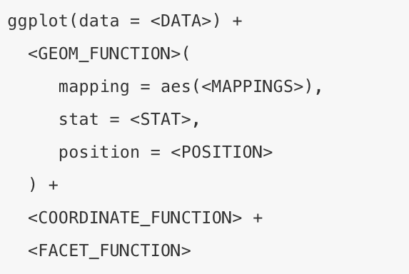

## Logistics
  * 6:30pm ~ 7:00pm networking
    * slack chanel #rfordatascienceclub
  * 7:00pm ~ 8:30pm summary and discussion 


## Chapter 1
 How to get help 
 
  * #### add required packages
  * #### include reproducible data
  * #### make code readable to others
  
## Include data

```{r chapter1 }
dput(mtcars)

```

```{r setup, include = F, echo = T, results = "hide"}
library(tidyverse)
```
## Chapter 3 
Useful tips

1.glimpse

```{r chapter3.1, echo = T}
glimpse(mtcars)
count(mpg, drv, class)
```

## 2. count

```{r chapter3.2, echo = T}
count(mpg, drv, class)
```
## Formular 



## Questions
1. Exercise 3.2.5
2. Exercise 3.3.1
3. Exercise 3.3.6
4. Exercise 3.5.4
5. Exercise 3.6.6
6. Exercise 3.7.1
7. Exercise 3.7.5


## Next time 
Chapter 4,5,6

@Newport Beach Public library 

1000 Avocado Avenue, Newport Beach CA 92660

Charles Sword Meeting Room on the second floor

Thursday, Jan. 16th, 2020 6:30pm ~ 8:30pm

## Session Host