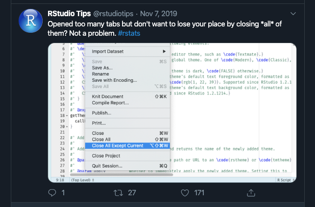
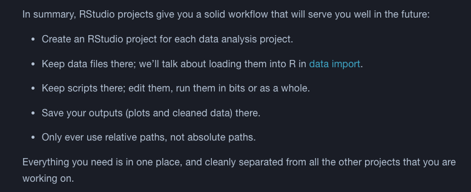

```{r setup, include=FALSE}
knitr::opts_chunk$set(echo = TRUE)

library(nycflights13)
library(tidyverse)
```


## Look Back to last week (ch 1)

### ggplot Formula:

``` {echo =FALSE}
ggplot(data = <DATA>) +
  <GEOM_FUNCTION>(
    mapping = aes(<MAPPINGS>),
    stat = <STAT>,
    position = <POSITION>
  ) + 
  <COORDINATE_FUNCTION> +
  <FACET_FUNCTION>
```

## Look Back to last week (ch 3)

### dplyr functions never modify their inputs

`filter()`, `arrange()`, `select()`, `mutate()`, `group_by()`

> "Naming things is hard, so this slows down our analysis"

We can use a pipe ` %>% `  (mac keyboard shortcut ⇧⌘M)

```{r }
delays <- flights %>% 
  group_by(dest) %>% 
  summarise(
    count = n(),
    dist = mean(distance, na.rm = TRUE),
    delay = mean(arr_delay, na.rm = TRUE)
  ) %>% 
  filter(count > 20, dest != "HNL")
```

## Warm up Exercises
Some might be a little difficult for a warm up 

1. Exercise 5.2.1
1. Exercise 5.4.3
1. Exercise 5.5.2
1. Exercise 5.6.5
1. Exercise 5.7.3
1. Exercise 5.7.2

## Chapter 4


## Chapter 5
### Iterative EDA Cycle
1. Generate questions about your data.
1. Search for answers by visualising/transforming/modeling your data.
1. Using what you learn to refine/generate new questions.

### "EDA is a state of mind"

## EDA Questions
### Two helpful question types.
1. What type of variation occurs within my variables?
1. What type of covariation occurs between my variables?

## Chapter 6


## Data Wrangling


This week we are sticking with Import 


## Chapter 7
> tibbles are opinionated data frames

```{r echo=FALSE}
flights %>% head(2) %>% print(n_extra=2)
```


```{r echo=FALSE}
as.data.frame(flights) %>% head(2)
```

## Chapter 8
### readr vs base R
  * readr functions are typically much faster
  * readr functions produce tibbles
  * readr functions are more reproducible
    * base R inherits from OS
    
## Questions

### EDA
1. Exercise 7.3.2/4
1. Exercise 7.5.2.2
1. Exercise 7.5.3.2/3

### Tibbles
1. Exercise 10.5.3

### Data Import
1. Exercise 11.2.2/4
1. Exercise 11.4.7