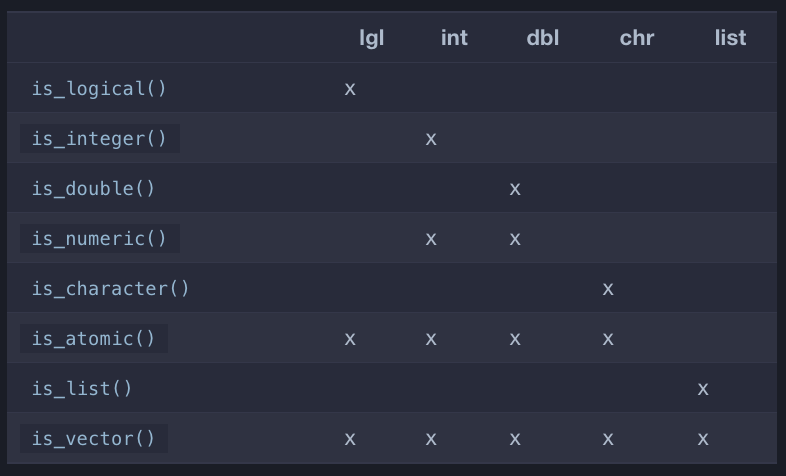
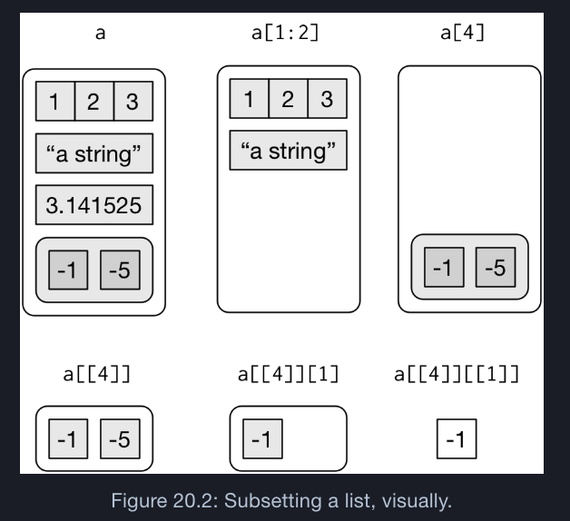

```{r setup, include=FALSE}
knitr::opts_chunk$set(echo = FALSE)
library(tidyverse)
```

## Vector Basics

### Two types of vectors
1. Atom
1. Lists

vectors are **homogeneous** while lists can be **heterogeneous**.

`NULL` can represent the absence of a vector where `NA` can represent the absence of a value


## Vector Coercion

**Explicit coercion** happens with functions like `as.logical()`, `as.integer()`, `as.double()`, `as.character()`.

**Implicit coercion** happens when using a vector in a specific context that expects a certain type of vector.

```{r echo=TRUE}
x <- sample(20, 100, replace = TRUE)
y <- x > 10
sum(y)
mean(y)
```

## Vector Coercion

When creating a vector containing multiple types with `c()`: the most complex type always wins.

If a mix of multiple types are needed in the same vector, a list should be used.

## Test functions


## Scalars & Recycling

R will implicity coerce the length of vectors. 

```{r echo=TRUE}
1:10 + 1:0 #The shorter vector is repeated to the longer length
1:10 + 2:0 #Warned if longer vector must be a multiple of the shorter

```

>The vectorised functions in tidyverse will throw errors when recycling anything other than a scalar

## Naming Vectors

All types of vectors can be named.

```{r echo=TRUE}
c(a=1,b=2,c=3)
set_names(1:3, c("a","b","c"))
```

## Subsetting

`x[a]`

There are four types of things a vector can be subset with:

1. A numeric vector (all positive, all negative, or zero)
1. A logical vector (keeps  all values corresponding to TRUE)
1. A character vector (if the original vector is named)
1. Nothing `x[]` (more useful when subsetting matrices)

## lists

Lists are more suitable for representing herarchivcal or tree-like structures.

`str()` focusses on the structure, not the contents

```{r}
z <- list(a=list(1,2),b=list('a',1:2))
```
```{r echo=TRUE}
str(z)
```

## [ vs [[

```{r}
a <- list(a = 1:3, b = "a string", c = pi, d = list(-1, -5))
```


## Attributes

Any vector can contain arbitrary additional metadata through its attributes.

Three important attributes:

1. **Names** are used to name the elements of a vetctor.
1. **Dimensions** (dims) make a vector behave like a matrix
1. **Class** is used to implement the S3 object oriented system

>Because augmented vectors have a class, they behave differently to the atomic vector on which they are built.

## For Loops

```{r}
df <- tibble(
  a = rnorm(10),
  b = rnorm(10),
  c = rnorm(10),
  d = rnorm(10)
)
```


```{r echo=TRUE}
output <- vector("double", ncol(df)) 
for (i in seq_along(df)) { ## 1:length(df) with 0 length handling
  output[[i]] <- median(df[[i]]) 
}
output
```

## Looping Patterns

`for (i in seq_along(xs))` extract with `x[[i]]`

`for (x in xs)`  loops over the elements

`for (nm in names(xs))`  extract with `x[[nm]]`

## While loops

Usefull when the number of iterations is not known in advance (like simulations)
```{r echo=TRUE}
flip <- function() sample(c("T", "H"), 1)

flips <- 0
nheads <- 0

while (nheads < 3) {
  if (flip() == "H") {
    nheads <- nheads + 1
  } else {
    nheads <- 0
  }
  flips <- flips + 1
}
flips
```


## For loops vs. functionals

> For loops are not as important in R as they are in other languages because R is a functional programming language.

```{r}
df <- tibble(a=rnorm(10),b=rnorm(10),c=rnorm(10),d=rnorm(10))
```


```{r echo=TRUE}
output <- vector("double",length(df))
for (i in seq_along(df)) {
  output[[i]] <- mean(df[[i]])
}
output
```

```{r echo=TRUE}
col_mean <- function(df) {
  output <- vector("double",length(df))
  for (i in seq_along(df)) {
    output[[i]] <- mean(df[[i]])
  }
  output
}
```


## The Map Functions

Each function takes a vector as input, applies a function to each piece, and then returns a new vector that’s the same length (and has the same names) as the input.

>Some people will tell you to avoid for loops because they are slow. They’re wrong! (Well at least they’re rather out of date, as for loops haven’t been slow for many years.) The chief benefits of using functions like `map()` is not speed, but clarity: they make your code easier to write and to read.

## safely

```{r echo=TRUE}
safe_log <- safely(log)
str(safe_log(10))
str(safe_log("a"))
```

## possibly

```{r echo=TRUE}
x <- list(1,10,"a")
x %>% map_dbl(possibly(log, NA_real_))
```

> always succeeds with a default value to return when there is an error.

## quietly

```{r echo=TRUE}
x <- list(1,-1)
x %>% map(quietly(log)) %>% str()
```

> it captures printed output, messages, and warnings


## Exercises
20.3 1 Describe the difference between is.finite(x)...

20.3 2 Read the source code for dplyr::near()...

20.4 1 What does mean(is.na(x)) tell you about a vector x?...

20.4 4 Create functions that take a vector as input and returns...

20.7 1 What does `hms:hms(3600)` return? How does it print?...

21.2 2 Eliminate the for loop in each of the following examples...

21.2 3 part 3 Convert the song "99 bottles of beer on the wall"...

21.3 3 What happens if you use `for (nm in names(x))` and ...

21.3 4 What does this code do? How does it work?

## Exercises

21.5 1 Write code that uses one of the map functions to: ...

21.9 3 A possible base R equivalent of col_summary() is:...
