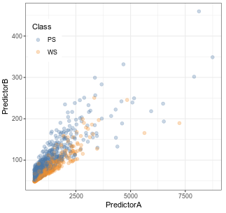
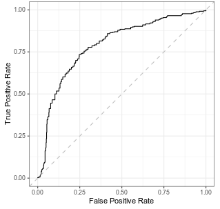
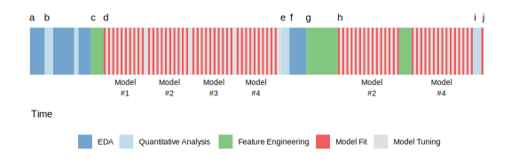
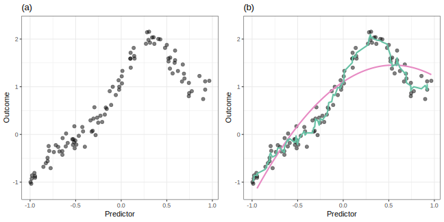

# House keeping
1. Introductions
1. Expectations
1. Using slack
1. Using github

---

# Introduction

Definitions
* **Parsimony**: simpler models are preferable to complex
* **feature engineering**: The process of creating representations of data that
increase the effectiveness of a model

Question: When would you want more complex models?

---

Models **can** be sensitive to:

1. Multicollinearity
1. Missing values
1. Irrelevant predictors

Question: For each one of these, name a model class where it is true and where
it is not true.

---

#  1.1 Simple Example

Accuracy and/or simplicity can sometimes be improved by representing data in ways
that are more palatable to the model or by decreasing the number of variables used

Question: Why may a Box-Cox transformation help improve a model with this data?

---

ROC curve evaluates the results on all possible cut-off points for a binary
classification

Question:
1. How do you select a cutoff point based on the ROC?
1. Why is the curve monotonic increasing?

---

## 1.2 Important Concepts

**Overfitting**: Fits the training data well but does not fit new data well
* i.e. does not generalize
* low bias models tend to overfit
* models can overfit the **predictors** when a predictor appears important in 
the training data but is not important on new data
    * happens when `n` is small and `p` is large

Question: How do you detect overfitting?

---

**Supervised Learning**: Identifying patterns between predictors and outcomes.

**Unsupervised Learning**: Identifying patterns among predictors

Question: 
1. Name some model classes and identify them as supervised or unsupervised.
1. When would you use unsupervised learning?

---

**No Free Lunch**: Without any specific knowledge of the problem or data, on one
predictive model can be said to be the best.

Question: How do you choose your model classes when working on a new problem?

---

**The Model vs. the Modelling Process**

Model building is both iterative and heuristic

Question:
1. What do you do in an EDA?
1. What do you do in a quantitative analysis (QA)?
1. What is the different in the EDA and QA late in the process vs. early in the
process?

---

**Variance**: The degree in which the values can fluctuate

**Bias**: The degree in which something deviates from its true underlying value

**Model bias**: The ability of the model to conform to the underlying theoretical
structure of the data
* **low-bias model** is one that can be highly flexible and has the capacity to fit a
variety of different shapes and patterns
* **high-bias model** would be unable to estimate values close to the true theoretical
counterparts

**Bias-variance trade-off**: To achieve low bias, models tend to demonstrate high
variance (and vice versa).

Question: 
1. Pick a class of model and determine if it is high/low bias/variance and explain
why
2. How do you control the bias-variance trade-off in that class of model

---

Green is 3-point moving average

Red is a linear regression with a polynomial term

Question:
1. For each model, determine if they are low/high bias/variance?
1. What are the problems with using each model?

---

Theoretically, if the functional form could be determined from the data, then 
the best possible model would be a non-linear regression model.

Question: Discuss what this statement means.

---

**Experience-Driven Modelling and Empirically Driven Modelling**

Experience-driven modelling use parameters defined by the experts.

Data-drive modelling allows the data to select which features are included.
1. This approaches run the risk of overfitting to false patterns. 
1. It may yield models that are highly complex and may not have any obvious 
rational explanation.

While the best approach is usually a combination of each.

Question: What are the pros and cons of an experience-drive approach to modelling?

---

**Big Data**

* high-bias, low-variance models with large amounts of data tend to drive down
the standard errors but does not tend it improve the parameter estimates.

Question: Explain why the SE is driven down by why the parameter estimate is not improved.

---

# 1.3 A more complex example

1. When modelling data, there is almost never a single model fit or feature set
that will immediately solve the problem. The process is more likely to be a 
campaign of trial and error to achieve the best results.
1. The effect of feature sets can be much larger than the effect of different models.
1. The interplay between models and features is complex and somewhat unpredictable.
1. With the right set of predictors, it is common that many different types of models
can achieve the same level of performance.

Question: Discuss "The effect of feature sets can be much larger than the effect 
of different models." Why is this true?

---

# 1.4 Feature Selection

There are a number of different strategies for supervised feature selection:

1. **Wrapper methods**: use an external search procedure to choose different
subsets of the predictors to evaluate the model. This approach separates the
feature search process from the model fitting process.
1. **Embedded methods**: the feature selection procedure occurs naturally in the 
course of the model fitting process.

Question: What are some wrapper and embedded methods?

---
# 1.4 Feature Selection

The text did not define supervised and unsupervised feature selection but 
it gave examples.

Question: What is the difference between supervised and unsupervised feature selection?
