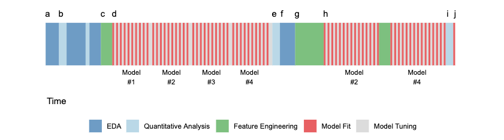
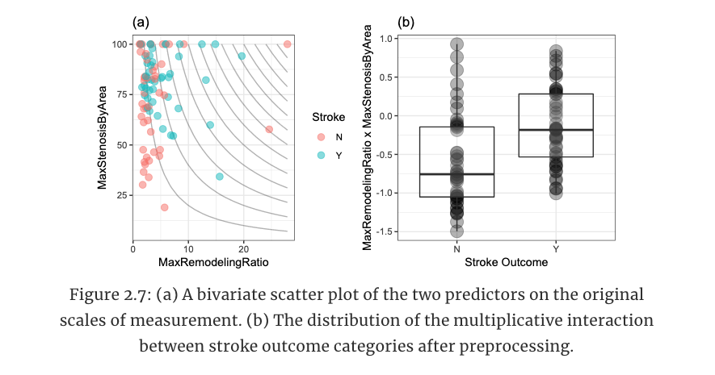

```{r setup, include=FALSE}
knitr::opts_chunk$set(echo = FALSE)

library(tidyverse)
library(tidymodels)
library(corrplot)
library(kableExtra)
library(caret)
library(utils)
library(pROC)
library(plotly)

```


```{r load_files}
load(
  file.path(
    "..",
    "Data_Sets",
    "Ischemic_Stroke",
    "stroke_data.RData"
  )
)


VC_preds <- 
  c("CALCVol", "CALCVolProp", "MATXVol", "MATXVolProp", "LRNCVol", 
    "LRNCVolProp", "MaxCALCArea", "MaxCALCAreaProp", "MaxDilationByArea", 
    "MaxMATXArea", "MaxMATXAreaProp", "MaxLRNCArea", "MaxLRNCAreaProp", 
    "MaxMaxWallThickness", "MaxRemodelingRatio", "MaxStenosisByArea", 
    "MaxWallArea", "WallVol", "MaxStenosisByDiameter")

risk_preds <-
  c("age", "sex", "SmokingHistory", "AtrialFibrillation", "CoronaryArteryDisease", 
    "DiabetesHistory", "HypercholesterolemiaHistory", "HypertensionHistory")
```

# Chapter Goals

To present an abbreviated example of a modeling process similar to what was talked about in Chapter 1.



This example focuses on the exploration, analysis, and feature engineering of a single model.

---
# Predicting Risk of Ischemic Stroke

## Background

An ischemic stroke occurs when an artery in the brain becomes blocked. Historically, the degree arterial stenosis has been used to identify patients who are at risk for stroke. To reduce risk, patients with adequate blockage are recommeneded for surgical intervention to remove the blockage. 

Historical evidence suggests that this alone is a poor predictor of future stroke. 

---

## Methods

A historical set of patients with a range of blockages were selected. The data consisted of 126 patients, 44 of which had blockages greater than 70%. All had undergone 3D imaging and characterization of the blockage. The images were analyzed by software that generates anatomic structure estimage; percent stenosis, arterial wall thickness, and tissue characteristics.

The group of patients in the study also had follow-up information on whether or not a stroke occurred at a subsequent point in time. The association between blockage categorization and stroke outcome is not statistically significant, indicating that blockage categorization alone in not likely a good predictor of stroke outcome.

Other commonly collected clinical characteristics for risk stroke were also included in the data along with demographics of gender and age. 

To assess each set's predictive ability, a models will be trained using the risk, imaging, and a combination of the two predictors.

---
# Splitting

The data was split into two sets. The splitting was done in a stratified manner. Taking random splits in each of the outcome classes to keep the proportion of stoke patients approximately the same.

<style>
caption {
      color: grey;
      font-size: 0.8em;
      text-align: left;
    } 
</style>
```{r splitting}


pre_spread <- stroke_train %>% 
  count(Stroke) %>% 
  mutate(Data = "Training") %>% 
  bind_rows(
    stroke_test %>% 
      count(Stroke) %>% 
      mutate(Data = "Testing")
  ) 
knitr::kable(spread(pre_spread, Stroke, n), col.names = c("Data Set","Stroke = No", "Stroke = Yes"), caption = "Distribution of stroke outcomes by training and testing split") %>%
  kable_styling(bootstrap_options = "striped", full_width = F)
```


---

# Preprocessing

>One of the first steps of the modeling process is to understand important predictor characteristics such as their individual distributions, the degree of missingness within each predictor, potentially unusual values within predictors, relationships between predictors, and the relationship between each predictor and the response and so on.

```{r fig.show = "hold", out.width = "50%"}
fig_2_2_a <- 
  bind_rows(stroke_train, stroke_test) %>% 
  ggplot(aes(x = MaxLRNCArea)) +
  geom_histogram(bins = 15, col = "#D53E4F", fill = "#D53E4F", alpha = .5) +
  xlab("MaxLRNCArea") +
  ylab("Frequency") +
  ggtitle("Non-Transformed") +
  theme_bw() 

fig_2_2_b <- 
  recipe(Stroke ~ ., data = bind_rows(stroke_train, stroke_test)) %>% 
  step_YeoJohnson(all_predictors()) %>% 
  prep() %>% 
  juice() %>% 
  ggplot(aes(x = MaxLRNCArea)) +
  geom_histogram(bins = 15, col = "#D53E4F", fill = "#D53E4F", alpha = .5) +
  xlab("Transformed MaxLRNCArea") +
  ylab("Frequency") +
  ggtitle("Yeo-Johnson transformation") +
  theme_bw()
```

---
# Missing Data

The data was only missing 4 values across the subjects and predictors. Many models wont tolerate missing values. Imputation techniques may be required to replace the missing values with rational values. These missing values were replaced with the median value of the predictor.

What model classes will tolerate missing values?

What are some imputation techniques? Why might they be better than replacing with the meadian value?

---
# Exploring the Predictors

Many of the imaging prodictors are positively skewed. For example the max cross-sectional area of lipid-rich necrotic core (MaxLRNCArea), is positively skewed like that. This may have been due to the small subset of patients. Here the skewness is due to the underlying distribution of the data. The Box-Cox or Yeo-Johnson transformation was used to place the data on a scale where the distribution is aproximately symmetric. The area naturally grows by a power of 2 by the definition of how areas are calculated.

```{r dodge-st, fig.show = "hold", fig.width=10, out.width= "50%"}
fig_2_2_a
fig_2_2_b
```

---
# Highly Correleted Predictors

Predictors that are highly correlated will be removed. 

```{r include=FALSE}
risk_train <-
  recipe(Stroke ~ ., data = stroke_train) %>%
  step_center(VC_preds) %>%
  step_scale(VC_preds) %>%
  step_YeoJohnson(VC_preds) %>%
  prep() %>% 
  juice() %>%
  select(-one_of(c("Stroke", "NASCET", risk_preds)))

risk_corr <- cor(risk_train)
```

```{r fig.align="center"}
corrplot(risk_corr, addgrid.col = rgb(0, 0, 0, .05), order = "hclust")
```

---
# Exploration

The next step is to explore potential predictive relationships between individual predictors and the response and between pairs of predictors and the response.

A *Resampling* scheme was used to help protect against some overfitting.

1. *for* **each resample** *do*
1. | Use the resampl's 90% to fit models M1 and M2
1. | Predict the remaining 10% for both models
1. | Compute the aread under the ROC curve for M1 and M2
1. | Determin the difference in the two AUC values
1. *end*
1. Use a one sided t-test on the differences to test that m2 is better than M1


```{r compare_modules, warning = FALSE}
compare_models_1way <- function(a, b, metric = a$metric[1], ...) {
  mods <- list(a, b)
  rs <- resamples(mods)
  diffs <- diff(rs, metric = metric[1], ...)
  diffs$statistics[[1]][[1]]
}

null_mat <- data.frame(intercept = rep(1, nrow(stroke_train)))

ctrl <- 
  trainControl(method = "repeatedcv", repeats = 5,
               classProbs = TRUE, 
               summaryFunction = twoClassSummary)

set.seed(63331)
null_mod <- train(x = null_mat, 
                  y = stroke_train$Stroke, 
                  preProc = "YeoJohnson",
                  method = "glm", 
                  metric = "ROC", 
                  trControl = ctrl)
```

```{r cache=TRUE, warning = FALSE}
one_predictor_res <- 
  data.frame(Predictor = c(VC_preds, risk_preds), 
             Improvement = NA,
             Pvalue = NA,
             ROC = NA,
             stringsAsFactors = FALSE)

for (i in 1:nrow(one_predictor_res)) {
  set.seed(63331)
  var_mod <- train(Stroke ~ ., 
                   data = stroke_train[, c("Stroke", one_predictor_res$Predictor[i])], 
                   method = "glm", 
                   metric = "ROC",
                   trControl = ctrl)  
  tmp_diff <- compare_models_1way(var_mod, null_mod, alternative = "greater")
  one_predictor_res$ROC[i] <- getTrainPerf(var_mod)[1, "TrainROC"]
  one_predictor_res$Improvement[i] <- tmp_diff$estimate
  one_predictor_res$Pvalue[i] <- tmp_diff$p.value
}

```

---
## Risk Predictors

The results of the risk predictors are given from most significant to least significant in terms of improvment in ROC. Based on the results, the significant risk set will likely be integral to the final predictive model.

```{r}
one_predictor_res %>% 
  dplyr::filter(Predictor %in% risk_preds) %>% 
  arrange(Pvalue) %>% 
  mutate_if(is.numeric, round, digits = 4) %>% 
  knitr::kable(caption = "Improvement in ROC over null model of the risk set for predicting stroke outcome") %>%
  kable_styling(bootstrap_options = "striped", full_width = F)
```

---
## Imaging Predictors

```{r fig_2_4, cache=TRUE, warning=FALSE, include=FALSE}
vc_pred <- 
  recipe(Stroke ~ ., data = stroke_train %>% dplyr::select(Stroke, !!!VC_preds)) %>% 
  step_YeoJohnson(all_predictors()) %>% 
  prep(stroke_train %>% dplyr::select(Stroke, !!!VC_preds)) %>% 
  juice() %>% 
  gather(Predictor, value, -Stroke)

# get_max value per predictor

pred_max <- 
  vc_pred %>% 
  group_by(Predictor) %>% 
  summarize(max_val = max(value)) %>% 
  inner_join(one_predictor_res %>% dplyr::select(Pvalue, Predictor)) %>% 
  mutate(
    x = 1.5, 
    value = 1.25 * max_val,
    label = paste0("p-value: ", format.pval(Pvalue, digits = 2, sci = FALSE, eps = .0001))
  )

new_order <- pred_max$Predictor[order(pred_max$Pvalue)]

vc_pred <- 
  vc_pred %>% 
  mutate(Predictor = factor(Predictor, levels = new_order))

pred_max <- 
  pred_max %>% 
  mutate(Predictor = factor(Predictor, levels = new_order))

fig_2_4 <-
  ggplot(vc_pred, aes(x = Stroke, y = value)) + 
  geom_boxplot() + 
  geom_point(alpha = 0.3, cex = .5) + 
  geom_text(data = pred_max, aes(x = x, label = label), size = 3) + 
  facet_wrap(~Predictor, scales = "free_y") + 
  ylab("")
```

As with the risk predictors, the predictive performance of the intercept-only logistic regression model is compared to the model with each of the imaging predictors.
The MaxMaxWallThickness and MaxRemodelingRation have the strongest associations with stroke outcome.

```{r}
fig_2_4
```

---
### MaxRemodelingRatio

MaxRemodelingRatio indicates a significant shift in the average value between the stroke outcome classes. There is still considerable overlap between the distributions for within both classes. The ROC curve indicates that there is some signal for the predictor. 


```{r max_remodeling, fig.show = "hold",}
max_remodeling_ratio_box <-  vc_pred %>% filter(Predictor=='MaxRemodelingRatio') %>% 
  ggplot(aes(x = Stroke, y = value)) + 
    geom_boxplot() + 
    geom_point(alpha = 0.3, cex = .5)

fig_2_5 <- 
  roc_curve(stroke_train, Stroke, MaxRemodelingRatio) %>% 
  ggplot(aes(x = 1 - specificity, y = sensitivity)) + 
  geom_abline(alpha = .5, lty = 2) +
  geom_path()
```

```{r max_remodeling_plots, fig.show = "hold", fig.width=10, out.width= "50%"}
fig_2_5
max_remodeling_ratio_box
```

---
# Interaction exploration

For data that has a small number of predictors, all pair-wise interactions can be created. For numeric predictors, the interactions are simply generated by multiplying the values of each predictor. For each interaction term, the same resampling algorithm is used to quantify the cross-validated ROC from a model with only the two main effects and a model with the main effects and the interaction term.

```{r interactions, cache=TRUE, warning=FALSE}
pairs <- 
  combn(VC_preds, 2) %>% 
  t() %>% 
  as.data.frame(stringsAsFactors = FALSE) %>% 
  mutate(
    Improvement = NA,
    Pvalue = NA,
    ROC = NA
  )

for (i in 1:nrow(pairs)) {
  tmp_vars <- c("Stroke", pairs$V1[i], pairs$V2[i])
  set.seed(63331)
  main_eff <- train(Stroke ~ ., 
                    data = stroke_train[, tmp_vars], 
                    preProc = c("center", "scale", "YeoJohnson"),
                    method = "glm", 
                    metric = "ROC",
                    trControl = ctrl)
  set.seed(63331)
  main_int <- train(Stroke ~ (.)^2, 
                    data = stroke_train[, tmp_vars], 
                    preProc = c("center", "scale", "YeoJohnson"), 
                    method = "glm", 
                    metric = "ROC", 
                    trControl = ctrl)  
  tmp_diff <- compare_models_1way(main_int, main_eff, alternative = "greater")
  pairs$ROC[i] <- getTrainPerf(main_eff)[1, "TrainROC"]
  pairs$Improvement[i] <- tmp_diff$estimate
  pairs$Pvalue[i] <- tmp_diff$p.value
}
retained_pairs <- 
  pairs %>% 
  dplyr::filter(ROC > 0.5  & Pvalue <= 0.2)
```

```{r fig_2_6, warning=FALSE,  out.width= "100%"}
vol_plot <- 
  pairs %>% 
  dplyr::filter(ROC > 0.5) %>%
  mutate(Term = paste(V1, "by", V2, "\nROC:", round(ROC, 2))) %>%
  ggplot(aes(x = Improvement, y = -log10(Pvalue))) + 
  xlab("Improvement") +
  geom_point(alpha = .2, aes(size = ROC, text = Term))

vol_plot <- ggplotly(vol_plot, tooltip = "Term")
vol_plot
```

```{r }
## Create interaction formula
int_form <- 
  pairs %>% 
  dplyr::filter(ROC > 0.5  & Pvalue <= 0.2 & Improvement > 0) %>% 
  mutate(form  = paste0(V1, ":", V2)) %>% 
  pull(form) %>% 
  paste(collapse = "+")
int_form <- paste("~", int_form)
int_form <- as.formula(int_form)

save(int_form, file = "interactions.RData")
```

---
## MaxRemodelingRatio and MaxStenosisByArea

Figure 2.7 illustrates the relationship between these two predictors. Patients who did not have a stroke generally had lower product outcomes, where patients with strokes had higher product outcomes. The boxplot shows the seperations of the distributions of product outcomes for the outcome classes.



```{r}
risk_train <- 
  stroke_train %>%
  dplyr::select(one_of(risk_preds), Stroke)

image_train <- 
  stroke_train %>%
  dplyr::select(one_of(VC_preds), Stroke)
```

```{r}
fiveStats <- function(...) c(twoClassSummary(...), defaultSummary(...))
internal_ctrl = trainControl(method = "none", classProbs = TRUE,
                             allowParallel = FALSE)
lrFuncsNew <- caretFuncs  
lrFuncsNew$summary <- fiveStats
rfeCtrl <- rfeControl(functions = lrFuncsNew,
                      method = "repeatedcv",
                      repeats = 5,
                      rerank = FALSE,
                      returnResamp = "all",
                      saveDetails = TRUE,
                      verbose = FALSE)
```

---
# Predictive Modeling Across Sets

>Physicians have a strong preference towards logistic regression due to its inherent interpretability.

In order to find the most predictive logistic regression model, the most relevant predictors should be identified to find the best subset for predicting stroke risk. 
* Predictive performance of logistic regression is also degraded by the inclusion of correlated, non-informative predictors
* Logistic regression tends to yield lower predictivity than low-bias high-variance models.

A recursive feature elimination (RFE) routine was used to determine if less predictors would be advantageous

---
## Correlation 

While there are more sophisticated approaches, an additional variable filter will be used on the data to remove the minimum set of predictors such that no pairwise correlations between predictors are greater than 0.75

---
## Recursive Feature Elimination

RFE is a simple backwards selection procedure where the largest model is used initially and, from this model, each predictor is ranked in importance. For logistic regression, there are several methods for determining importance, and the absolute value of the regression coefficient for each model term (after the predictors have been centered and scaled) is used here.

The RFE procedure begins to remove the least important predictors, refits the model, and evaluates performance. At each model fit, the predictors are preprocessed by an initial Yeo-Johnson transformation as well as centering and scaling.

 *The RFE procedure is applied to:*
 
 * The small risk set of 8 predictors. Since this is not a large set, an interaction model with potentially all 28 pairwise interactions.
* The set of 19 imaging predictors. The interaction effects are also considered.
* The entire set of predictors. The imaging interactions are also combined with these variables.


```{r parellal_setup, include=FALSE}
# Running in parallel for Windows, a different package can be used
library(doMC)
registerDoMC(cores = parallel::detectCores(logical = FALSE) - 1)
```

```{r cross_set_rfe, warning=FALSE, eval = FALSE}
risk_int_filtered_recipe <-
  recipe(Stroke ~ ., data = risk_train) %>%
  step_interact(~ all_predictors():all_predictors()) %>%
  step_corr(all_predictors(), threshold = 0.75) %>% 
  step_center(all_predictors()) %>%
  step_scale(all_predictors()) %>%
  step_zv(all_predictors())

set.seed(63331)
risk_int_filtered_rfe <- rfe(
  risk_int_filtered_recipe,
  data = risk_train,
  sizes = 1:36,
  rfeControl = rfeCtrl,
  metric = "ROC",
  ## train options
  method = "glm",
  trControl = internal_ctrl
)

# Main effects
risk_main_filtered_recipe <-
  recipe(Stroke ~ ., data = risk_train) %>%
  step_corr(all_predictors(), threshold = 0.75) %>% 
  step_center(all_predictors()) %>%
  step_scale(all_predictors()) %>%
  step_zv(all_predictors())

set.seed(63331)
risk_main_filtered_rfe <- rfe(
  risk_main_filtered_recipe,
  data = risk_train,
  sizes = 1:8,
  rfeControl = rfeCtrl,
  metric = "ROC",
  ## train options
  method = "glm",
  trControl = internal_ctrl
)

# ------------------------------------------------------------------------------
# RFE procedure using imaging predictors

img_int_filtered_recipe <-
  recipe(Stroke ~ ., data = image_train) %>%
  step_interact(int_form)  %>%
  step_corr(all_predictors(), threshold = 0.75) %>%
  step_center(all_predictors()) %>%
  step_scale(all_predictors()) %>%
  step_YeoJohnson(all_predictors()) %>%
  step_zv(all_predictors())

set.seed(63331)
img_int_filtered_rfe <- rfe(
  img_int_filtered_recipe,
  data = image_train,
  sizes = 1:35,
  rfeControl = rfeCtrl,
  metric = "ROC",
  ## train options
  method = "glm",
  trControl = internal_ctrl
)

img_main_filtered_recipe <-
  recipe(Stroke ~ ., data = image_train)  %>%
  step_corr(all_predictors(), threshold = 0.75) %>%
  step_center(all_predictors()) %>%
  step_scale(all_predictors()) %>%
  step_YeoJohnson(all_predictors()) %>%
  step_zv(all_predictors())

set.seed(63331)
img_main_filtered_rfe <- rfe(
  img_main_filtered_recipe,
  data = image_train,
  sizes = 1:19,
  rfeControl = rfeCtrl,
  metric = "ROC",
  ## train options
  method = "glm",
  trControl = internal_ctrl
)

# ------------------------------------------------------------------------------

both_int_filtered_recipe <-
  recipe(Stroke ~ ., data = stroke_train) %>%
  step_interact(int_form)  %>%
  step_corr(all_predictors(), threshold = 0.75) %>%
  step_center(all_predictors()) %>%
  step_scale(all_predictors()) %>%
  step_YeoJohnson(all_predictors()) %>%
  step_zv(all_predictors())

set.seed(63331)
both_int_filtered_rfe <- rfe(
  both_int_filtered_recipe,
  data = stroke_train,
  sizes = 1:44,
  rfeControl = rfeCtrl,
  metric = "ROC",
  ## train options
  method = "glm",
  trControl = internal_ctrl
)

both_main_filtered_recipe <-
  recipe(Stroke ~ ., data = stroke_train)  %>%
  step_corr(all_predictors(), threshold = 0.75) %>%
  step_center(all_predictors()) %>%
  step_scale(all_predictors()) %>%
  step_YeoJohnson(all_predictors()) %>%
  step_zv(all_predictors())

set.seed(63331)
both_main_filtered_rfe <- rfe(
  both_main_filtered_recipe,
  data = stroke_train,
  sizes = 1:28,
  rfeControl = rfeCtrl,
  metric = "ROC",
  ## train options
  method = "glm",
  trControl = internal_ctrl
)

# ------------------------------------------------------------------------------

risk_int_recipe <-
  recipe(Stroke ~ ., data = risk_train) %>%
  step_interact(~ all_predictors():all_predictors()) %>%
  step_center(all_predictors()) %>%
  step_scale(all_predictors()) %>%
  step_zv(all_predictors())

set.seed(63331)
risk_int_rfe <- rfe(
  risk_int_recipe,
  data = risk_train,
  sizes = 1:36,
  rfeControl = rfeCtrl,
  metric = "ROC",
  ## train options
  method = "glm",
  trControl = internal_ctrl
)

risk_main_recipe <-
  recipe(Stroke ~ ., data = risk_train) %>%
  step_center(all_predictors()) %>%
  step_scale(all_predictors()) %>%
  step_zv(all_predictors())

set.seed(63331)
risk_main_rfe <- rfe(
  risk_main_recipe,
  data = risk_train,
  sizes = 1:8,
  rfeControl = rfeCtrl,
  metric = "ROC",
  ## train options
  method = "glm",
  trControl = internal_ctrl
)

# ------------------------------------------------------------------------------

img_int_recipe <-
  recipe(Stroke ~ ., data = image_train) %>%
  step_interact(int_form)  %>%
  step_center(all_predictors()) %>%
  step_scale(all_predictors()) %>%
  step_YeoJohnson(all_predictors()) %>%
  step_zv(all_predictors())

set.seed(63331)
img_int_rfe <- rfe(
  img_int_recipe,
  data = image_train,
  sizes = 1:35,
  rfeControl = rfeCtrl,
  metric = "ROC",
  ## train options
  method = "glm",
  trControl = internal_ctrl
)

img_main_recipe <-
  recipe(Stroke ~ ., data = image_train)  %>%
  step_center(all_predictors()) %>%
  step_scale(all_predictors()) %>%
  step_YeoJohnson(all_predictors()) %>%
  step_zv(all_predictors())

set.seed(63331)
img_main_rfe <- rfe(
  img_main_recipe,
  data = image_train,
  sizes = 1:19,
  rfeControl = rfeCtrl,
  metric = "ROC",
  ## train options
  method = "glm",
  trControl = internal_ctrl
)

# ------------------------------------------------------------------------------

both_int_recipe <-
  recipe(Stroke ~ ., data = stroke_train) %>%
  step_interact(int_form)  %>%
  step_center(all_predictors()) %>%
  step_scale(all_predictors()) %>%
  step_YeoJohnson(all_predictors()) %>%
  step_zv(all_predictors())

set.seed(63331)
both_int_rfe <- rfe(
  both_int_recipe,
  data = stroke_train,
  sizes = 1:44,
  rfeControl = rfeCtrl,
  metric = "ROC",
  ## train options
  method = "glm",
  trControl = internal_ctrl
)

both_main_recipe <-
  recipe(Stroke ~ ., data = stroke_train)  %>%
  step_center(all_predictors()) %>%
  step_scale(all_predictors()) %>%
  step_YeoJohnson(all_predictors()) %>%
  step_zv(all_predictors())

set.seed(63331)
both_main_rfe <- rfe(
  both_main_recipe,
  data = stroke_train,
  sizes = 1:28,
  rfeControl = rfeCtrl,
  metric = "ROC",
  ## train options
  method = "glm",
  trControl = internal_ctrl
)

# ------------------------------------------------------------------------------

format_data <- function(x, lab, int = FALSE) {
  dat <- 
    x %>% 
    pluck("results") %>% 
    mutate(Predictors = !!lab) %>% 
    dplyr::select(ROC, Variables, Predictors, Variables, Num_Resamples) %>% 
    mutate(Model = "Main Effects")
  if (int)
    dat$Model <- "Interactions"
  dat
  
}

filtered_dat <- 
  format_data(risk_main_filtered_rfe, lab = "Risk Predictors") %>% 
  bind_rows(
    format_data(risk_int_filtered_rfe, lab = "Risk Predictors", TRUE),
    format_data(img_main_filtered_rfe, lab = "Imaging Predictors"),
    format_data(img_int_filtered_rfe, lab = "Imaging Predictors", TRUE),
    format_data(both_main_filtered_rfe, lab = "All Predictors"),
    format_data(both_int_filtered_rfe, lab = "All Predictors", TRUE)
  ) %>% 
  mutate(
    Predictors = factor(
      Predictors, 
      levels = c("Risk Predictors", "Imaging Predictors", "All Predictors")
    ),
    Model = factor(Model, levels = c("Main Effects", "Interactions")),
    Filtering = "Correlation Filter"
  )

unfiltered_dat <- 
  format_data(risk_main_rfe, lab = "Risk Predictors") %>% 
  bind_rows(
    format_data(risk_int_rfe, lab = "Risk Predictors", TRUE),
    format_data(img_main_rfe, lab = "Imaging Predictors"),
    format_data(img_int_rfe, lab = "Imaging Predictors", TRUE),
    format_data(both_main_rfe, lab = "All Predictors"),
    format_data(both_int_rfe, lab = "All Predictors", TRUE)
  ) %>% 
  mutate(
    Predictors = factor(
      Predictors, 
      levels = c("Risk Predictors", "Imaging Predictors", "All Predictors")
    ),
    Model = factor(Model, levels = c("Main Effects", "Interactions")),
    Filtering = "No Filter"
  )

rfe_data <- 
  bind_rows(filtered_dat, unfiltered_dat) %>% 
  mutate(
    Filtering = factor(Filtering, levels = c("No Filter", "Correlation Filter"))
  )

```


```{r load_rfe}
load("stroke_rfe.RData")


format_data <- function(x, lab, int = FALSE) {
  dat <- 
    x %>% 
    pluck("results") %>% 
    mutate(Predictors = !!lab) %>% 
    dplyr::select(ROC, Variables, Predictors, Variables, Num_Resamples) %>% 
    mutate(Model = "Main Effects")
  if (int)
    dat$Model <- "Interactions"
  dat
  
}

filtered_dat <- 
  format_data(risk_main_filtered_rfe, lab = "Risk Predictors") %>% 
  bind_rows(
    format_data(risk_int_filtered_rfe, lab = "Risk Predictors", TRUE),
    format_data(img_main_filtered_rfe, lab = "Imaging Predictors"),
    format_data(img_int_filtered_rfe, lab = "Imaging Predictors", TRUE),
    format_data(both_main_filtered_rfe, lab = "All Predictors"),
    format_data(both_int_filtered_rfe, lab = "All Predictors", TRUE)
  ) %>% 
  mutate(
    Predictors = factor(
      Predictors, 
      levels = c("Risk Predictors", "Imaging Predictors", "All Predictors")
    ),
    Model = factor(Model, levels = c("Main Effects", "Interactions")),
    Filtering = "Correlation Filter"
  )

unfiltered_dat <- 
  format_data(risk_main_rfe, lab = "Risk Predictors") %>% 
  bind_rows(
    format_data(risk_int_rfe, lab = "Risk Predictors", TRUE),
    format_data(img_main_rfe, lab = "Imaging Predictors"),
    format_data(img_int_rfe, lab = "Imaging Predictors", TRUE),
    format_data(both_main_rfe, lab = "All Predictors"),
    format_data(both_int_rfe, lab = "All Predictors", TRUE)
  ) %>% 
  mutate(
    Predictors = factor(
      Predictors, 
      levels = c("Risk Predictors", "Imaging Predictors", "All Predictors")
    ),
    Model = factor(Model, levels = c("Main Effects", "Interactions")),
    Filtering = "No Filter"
  )

rfe_data <- 
  bind_rows(filtered_dat, unfiltered_dat) %>% 
  mutate(
    Filtering = factor(Filtering, levels = c("No Filter", "Correlation Filter"))
  )

rfe_tab <-
  img_main_filtered_rfe %>% 
  pluck("variables") %>% 
  group_by(var) %>% 
  count() %>% 
  arrange(desc(n)) %>% 
  mutate(final = ifelse(var %in% img_main_filtered_rfe$optVariables, "Yes", "No")) %>% 
  ungroup()
  
```
---

The risk set, when only main effects are considered, the full set of 8 predictors is favored. When the full set of 28 pairwise interactions are added, model performance was hurt by the extra interactions. 

> Based on resampling, a set of 13 predictors was optimal (11 of which were interactions)


```{r fig_2_8, fig.width= 10, fig.asp=.39}
# https://bookdown.org/max/FES/predictive-modeling-across-sets.html#fig:stroke-rfe-res
ggplot(rfe_data, aes(x = Variables, y = ROC, col = Model)) +
  geom_point(size = 0.75) + 
  geom_line() + 
  facet_grid(Filtering ~ Predictors) + 
  scale_color_manual(values = c("#6A3D9A", "#CAB2D6")) +
  theme(legend.position="top")
```

---
When combining the two predictors sets, model performance without a correlation filter was middle-of-the-road and there was no real difference between the interaction and main effects models. Once the filter was applied, the data strongly favored the main effects model (with all 10 predictors that survived the correlation filter).
 
 