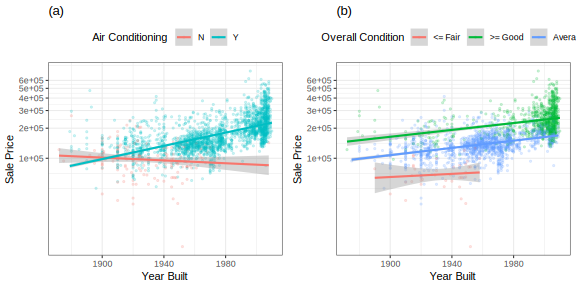
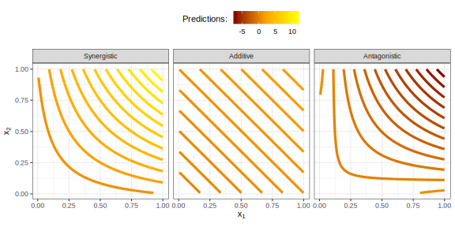
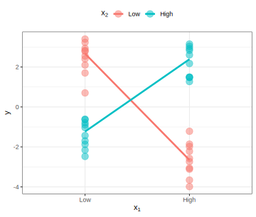
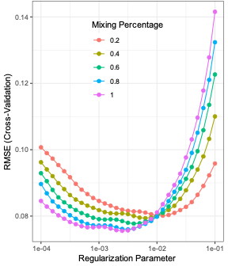
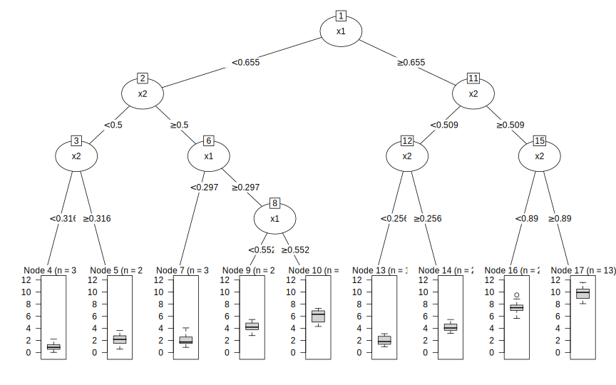
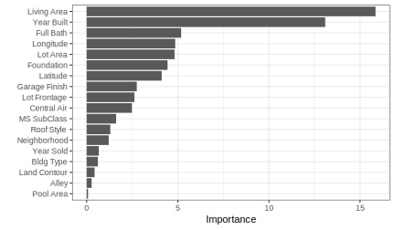

# Definitions
.large[
* **Interaction**: The effect of two or more predictors working in conjunction.
    * Predictors interact if their combined effect is different from the impact when their effects are considered alone.
* **main effect**: The effect of the individual predictors
]

---

# Interaction Visualized



a. Air conditioning and year built interact (slopes are different)

b. Condition and year built do not interact (slopes are parallel)

---

# Interaction - Mathematical

$$y = \beta_0 + \beta_1 x_1 + \beta_2 x_2 + \beta_3 x_1 x_2 + \text{error}$$
* $\beta_0$: overall average response
* $\beta_1$: average rate of change due to $x_1$ 
* $\beta_2$: average rate of change due to $x_2$
* $\beta_3$: average rate of change due to the combined effect of $x_1$ and $x_2$
* $\text{error}$: the random variation in the data

$\beta_3$ is useful for explaining the interaction:
1. **additive**: $\beta_3$ is n.s. different from zero, and $\beta_1$ and $\beta_2$ explain the response
1. **antagonistic**: $\beta_3$ is negative then $\beta_1$ and $\beta_2$, alone, explain the response.
1. **synergistic**: $\beta_3$ is positive then $\beta_1$ and $\beta_2$, alone, explain the response.
1. **atypical**: $\beta_3$ is significantly different from zero but $\beta_1$ and/or $\beta_2$ are n.s.

---

# Visualizing the Interaction



* Simulated data
* $\beta_0 = 0$
* $\beta_1 = \beta_2 = 1$
* $\beta_3 \in (-10, 0, 10)$ (antagonism, no interaction, synergism)

---

# Visualizing the Atypical Interaction
```{r, echo=FALSE, out.width = "500px", fig.align="center"}

```
$$y = 2 x_1 x_2 + \text{error}$$
* $x_1$ and $x_2$ are not significant predictors
* $x_1 \pm 1$ and $x_2 \pm 1$

---

# Guiding Principles: Search for Interactions

.medium[
* Use expert knowledge
* **hierarchy principle**: The higher degree of the interaction, the less likely the interaction will explain variation in the response.
* **effect sparsity**: only a fraction of the possible effects explain a significant amount of the response variation.
* **heredity principle**: interaction terms may only be considered if the ordered terms preceding the interaction term are effective at explaining the response variation
]

These are just principles and there may be exceptions

---
# Practical Considerations

.medium[
* Is it possible, with the available data, to enumerate and evaluate all possible interactions?
  * high order interactions are rare (effective sparsity)
  * high order interactions tend to not provide value (interaction hierarchy)
  * high order interactions should only be considered with expert knowledge
* Should the interaction terms be created before of after preprocessing?
  * Interaction effects may be lost if interactions are taken after preprocessing
  * Interaction terms *should* be created prior to preprocessing.
]

---
# Brute-Force Approach

.medium[
* For data sets with a small number of predictors, all possible pairwise interactions may be assessed
  * This increases the chances of an association by random chance may be found (false positive findings)
  
The approaches for screen are:
1. Simple Screening
1. Penalized Regression
]

---
# Brute-Force: Simple Screening

Nested models:

Main effects: $y = \beta_0 + \beta_1 x_1 + \beta_2 x_2 + \text{error}$

Main effects and interaction: $y = \beta_0 + \beta_1 x_1 + \beta_2 x_2 + \beta_3 x_1 x_2 \text{error}$

Approaches for assessing the significance of the interaction term
1. Traditional approach:
  * Use *objective function* as a significance test on the error
  * linear regression: likelihood
  * logistic regression: binomial likelihood
1. Resampling approach:
  * Resample to create various versions of the training set.
  * Any measure of performance can be used (AUC, sensitivity, specificity, etc.)
  
---
# Brute-Force: Simple Screening

.medium[
* There will be many significance tests. The p-value should be corrected.
  * [Bonferroni correction](https://en.wikipedia.org/wiki/Bonferroni_correction) is too conservative
  * The [false discovery rate](https://en.wikipedia.org/wiki/False_discovery_rate) (FDR) is more pragmatic
  
* Simple screening is reductive in that it considers each interaction term in isolation and not the effects with other interaction terms.
*  The resampling method tends to produce fewer interaction terms 
]

---
# Brute-Force: Penalized Regression

* *all-in* approach where the main effects and all the interactions are included
* This may result in a high-dimensional model (more predictors than observations)

**[Ridge](https://en.wikipedia.org/wiki/Tikhonov_regularization) regression**
$$SSE_{L_2} = \sum_{i=1}^n (y_i - \hat{y_i})^2 + \lambda_r \sum_{j=1}^P \beta_j^2$$
Used for combating collinearity  
$\beta_i$ tend towards zero but do not become zero

**[Lasso](https://en.wikipedia.org/wiki/Lasso_(statistics)) (least absolute shrinkage and selection) regression:**
$$SSE_{L_1} = \sum_{i=1}^n (y_i - \hat{y_i})^2 + \lambda_l \sum_{j=1}^P |\beta_j|$$
Used for feature selection.  
$\beta_i$ can become identically zero

---
# Brute-Force: Penalized Regression

glmnet balances the advantages of $L_1$ and $L_2$ penalizations.

$\alpha$ is in the range of (0,1)

$$SSE_{glmnet} = \sum_{i=1}^n (y_i - \hat{y_i})^2 + \lambda \left [(1-\alpha)\sum_{j=1}^P \beta_j^2 + \alpha \sum_{j=1}^P |\beta_j| \right]$$

* $\alpha = 1$ then it is a lasso regularization
* $\alpha = 0$ then it is a ridge regularization
```{r, echo=FALSE, out.width = "250px", fig.align="center"}

```

---
# When Complete Enumeration is Impractical

.medium[
Even when it may be computationally possible to assess all interactions, it may not be statistically wise due to false positive findings.

Techniques for determining interactions:
1. Two-stage modelling
1. Tree based methods
1. Feasible Solution Algorithm
]

---
# Impractical Enumeration: Two-stage modelling

.medium[
* **Stage 1**: Build a model that only considers the main effects
  * Linear or logistic regression are good choices
  * The model must not account for interaction (i.e. trees, NN)
  * Identify the predictors that are significant
* **Stage 2**: Build a model that has pairwise interaction terms using only the predictors that were significant
  * glmnet is a good choice to select important interaction terms

The first stage uses the heredity principle to search for interactions only from significant main effect predictors. The second stage uses the hierarchy principle to suggest looking at the pairwise interactions. The sparsity principle comes into effect by feature selection of the interaction terms.
]

---
# Impractical Enumeration: Tree-Based Methods

.medium[
* The objective of each split is to find the predictor that separates the samples into more homogeneous groups WRT the response
* This process is repeated on each subgroup until a stopping criteria is reached
* Each split is thought to have a localized interaction effect with the previous node and the current node.
* The more frequent the occurrence of the subsequent nodes of the same pair of predictors, the more likely that the interaction between the predictors is global.
]

---
# Impractical Enumeration: Tree-Based Methods
```{r, echo=FALSE, out.width = "450px", fig.align="center"}

```

The path to node 4 is:

$$node_4 = I(x_1 < 0.655) I(x_2 < 0.5) I(x_2 < 0.316) * 0.939$$
How many unique values could this model predict?  
If the observation falls into $node_4$ what is the value of all other leafs?

---
# Impractical Enumeration: Tree-Based Methods
.medium[
* Partitions are rectangular. Isogonic lines are approximated by having more splits
* This coarse nature generally makes trees less accurate than other models
]
```{r, echo=FALSE, out.width = "325px", fig.align="center"}
knitr::include_graphics("interactions-contour-and-tree-partition-1.svg")
```

---
# Impractical Enumeration: Tree-Based Methods
.medium[
Methods of mitigation:
1. **bagged trees**: Many sets of data are sampled with replacement. From each set a full-depth tree is created. The average of these trees is used as the predicted value.
1. **boosted trees**: The tree depth is restricted. The predictive performance on samples, from the previous tree, are used to re-weight the samples. The contribution of each tree in the boosted model is weighted based on model fit. A prediction on a new sample is the weighted combination across the entire forest
]

---
# Impractical Enumeration: Tree-Based Methods

Ensemble methods are effective because:
1. They are aggregating many weak predictors
1. They operate on slightly different versions of the date (high variance)
1. Aggregation allows for more possible responses

```{r, echo=FALSE, out.width = "325px", fig.align="center"}
knitr::include_graphics("interactions-contour-and-rf-boost-models-1.svg")
```
Note: Trees are complex but they can uncover significant interactions

The main premise of feature engineering is to find meaningful predictor relationships and then use a more appropriate model to estimate the relationship between the predictors and the response.

---
# Impractical Enumeration: Tree-Based Methods

.medium[
Determining the significant interactions:
1. Basu *et al.* used a weighted random forest that randomly selects features based on weights that are determined by feature importance. A metric for each co-occurring set of features is computed. This can be used for identifying the top interacting features.
1. Friedman and Popescu compute the H statistic by taking the effects of partial dependence between two features and comparing it to the effect of one of the features. The larger the difference the more important the interaction is.
1. In an approach similar to the two-stage model but with a tree as a base learner. The more often that a predictor is used in a split and the larger the importance of the split the more important the interaction is.
]

---
# Impractical Enumeration: Tree-Based Methods

A random forest can be used to compute the importance of predictors. Using the principle of heredity the significant main effect predictors can be used to limit the search for the interaction predictors.

```{r, echo=FALSE, out.width = "400px", fig.align="center"}

```

One of the most common methods from measuring feature importance in a random forest is [variance inflation factor](https://en.wikipedia.org/wiki/Variance_inflation_factor). i

---
# Impractical Enumeration: FSA

.medium[
* There are $p!$ possible models to assess

*Stepwise selection*
* Reduces the search space
* Forward, backward and hybrid
* Used with linear and logistic regression
]

---
# Impractical Enumeration: FSA

.medium[
**Feasible Solution Algorithm**
1. Choose the number of predictors, ($m$). For example 3 
1. Randomly select parameters ( $x_2$, $x_5$, $x_9$)
1. Compute the model performance
1. Retain first two predictors
  1. Build models on the other predictors
  1. Choose the best model where the third feature was replaced
1. Hold features one and three constant.
  1. Build models on other features
  1. Choose the best model
1. Hold features two and three constant
  1. Build models on other features
  1. Choose the best model
]

---
# Impractical Enumeration: FSA

.medium[
**Feasible Solution Algorithm**
* Will find local optimal but not the global optimal solution
* We should preform $q$ restarts using different random predictors
* Search space is $q \times m \times p$ instead of $p^m$
* Does not consider interaction terms
]

---
# Impractical Enumeration: FSA

.medium[
**Lambert**
* Searches for interaction terms
* Model includes base (main effect) and an interaction term
1. Start with a base model. For example ( $x_1$, $x_5$, $x_9$)
1. Create an interaction with $x_1$ and $x_2$
1. Fix the first predictor
  1. replace the second predictor with the remaining 8 or 9 predictors
  1. Keep the model with the best performance
1. Fix the second predictor
  1. repeat the process
1. Repeat until convergence

I am not clear on the steps in this algo
]

---
# Other Tools

.medium[
**Multivariate adaptive regression splines (MARS)**
  * uses hinge functions (ReLU)
  * Normally used to search through predictors
  * Can be used to search through interaction terms
  * Does feature selection
  * Computationally expensive
]

---
# Other Tools

.medium[
**Cubist**
  * rule-based regression
  * builds a tree, prunes it, then decomposes it into rules
  * Creates a separate linear model for each rule
]

```{r, echo=TRUE, eval=FALSE}
if
  Year_Built <= 1952
  Central_Air = No
  Longitude <= -93.6255
then
  log10 Scale_Price 261.38176 + 0.355 Gr_Liv_Area + 2.88 Longitude + 0.26 Latitude
```

.medium[
* creates disjointed interactions
* rules may not cover all possible values of predictions
* new observation may fit into multiple rules (average them)
* Excellent at finding interactions
]