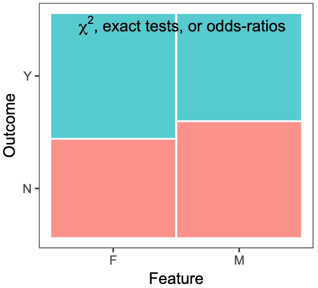
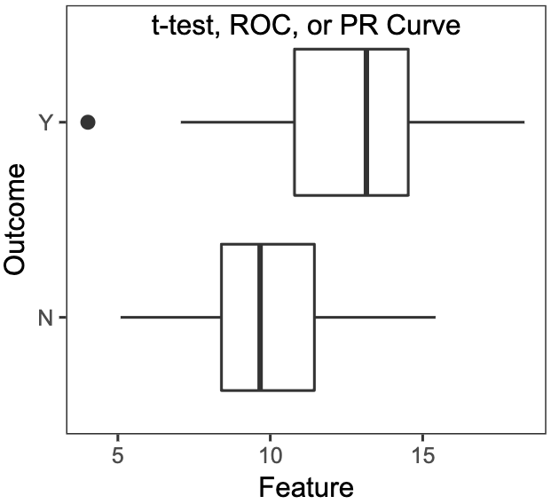
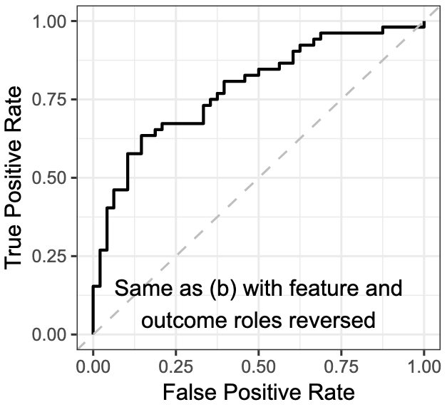
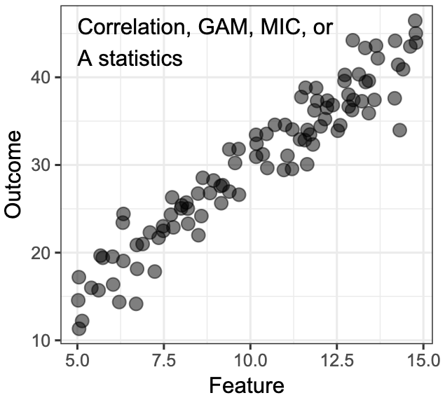
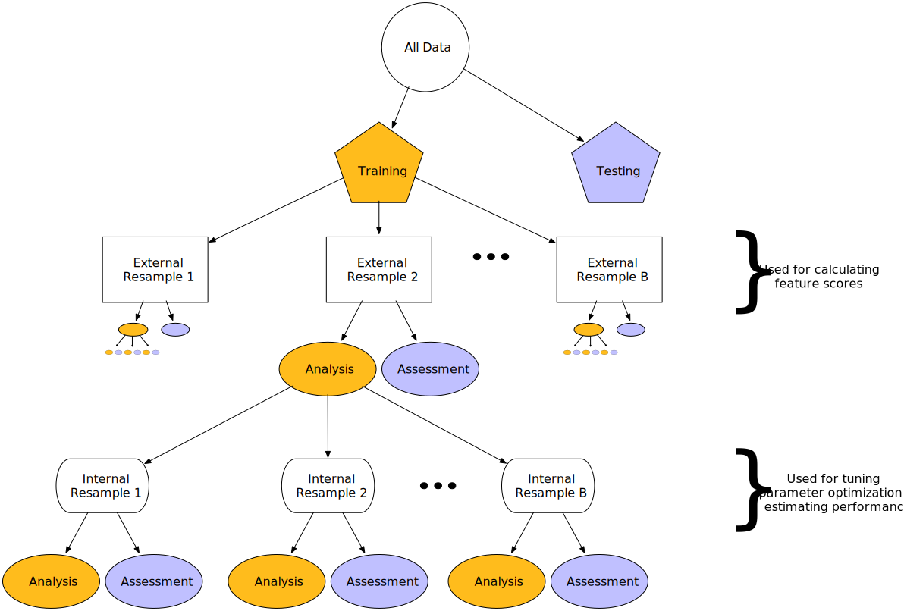
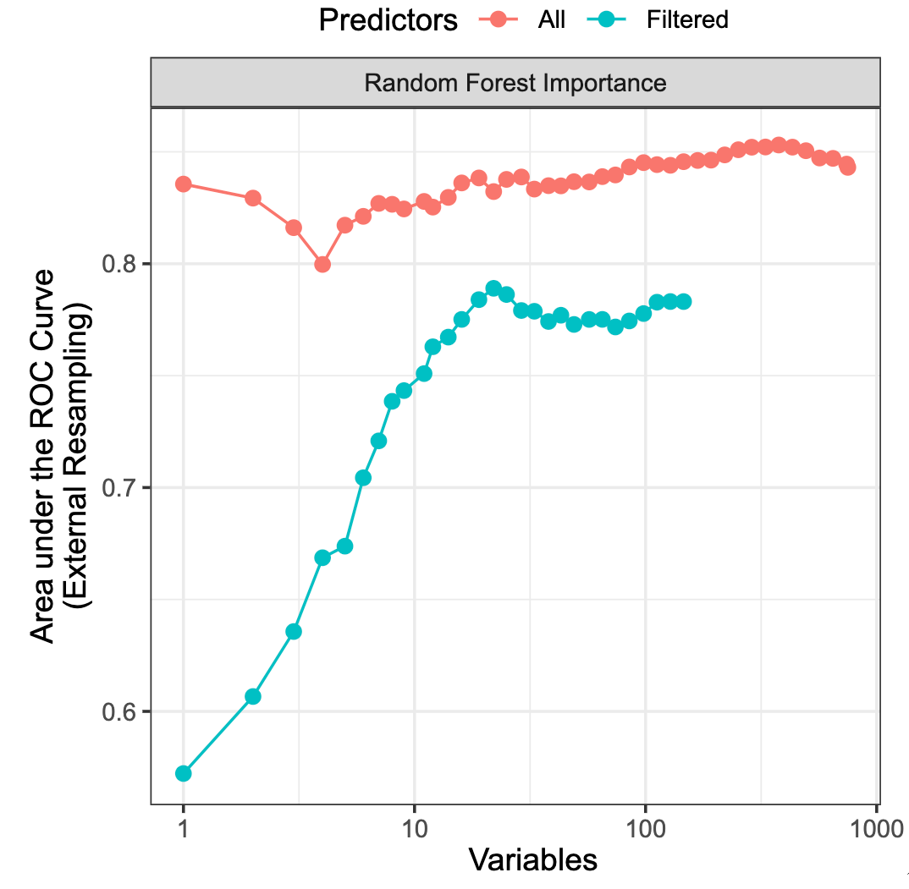
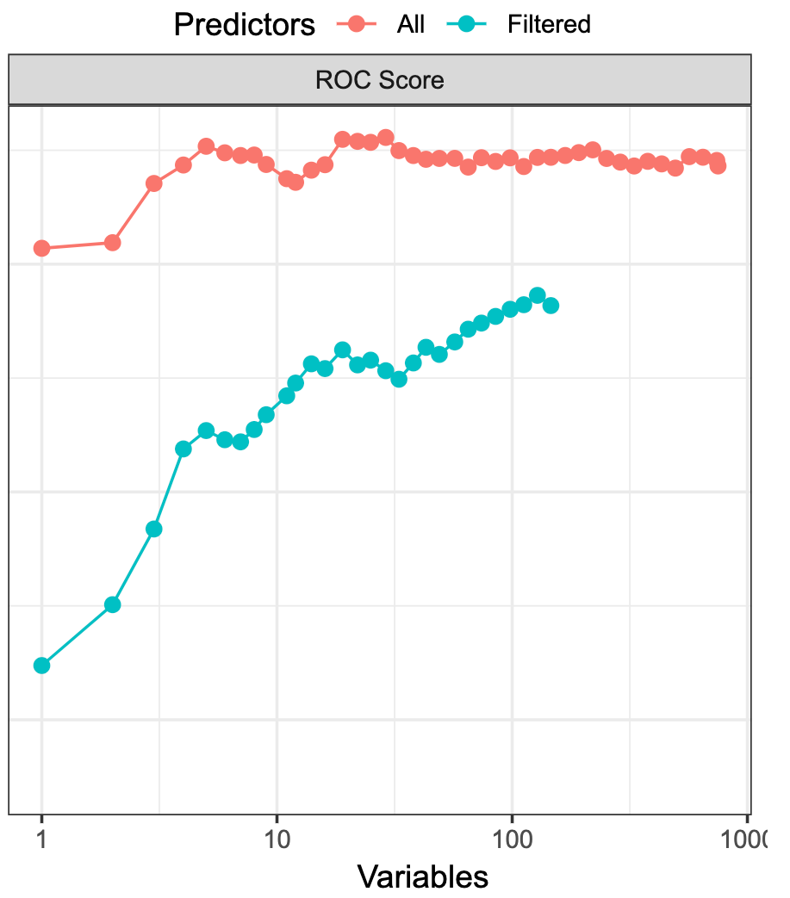
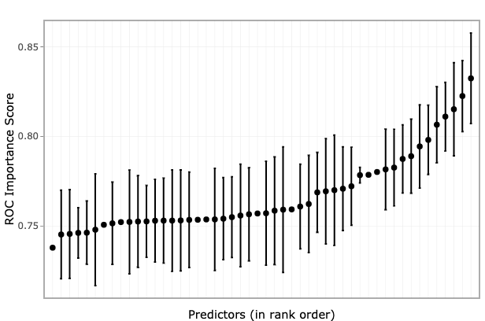

# Simple Filters
.large[
* A basic approach to feature selection is to see if a predictor has a relationship with the target
* Requires a numeric scoring technique to show relationship strength
* Predictors are ranked or filtered
    * Threshold or top $p$ predictors
* Scoring can be done simultaneously or one at a time
]

---

# Scoring Methods: Categorical Predictors
## Outcome is Categorical
.large[
* Two classes: odds-ratio $\frac{TP/FP}{FN/TN}$
* Multi-class: $\chi^2$ test - is there a difference between the expected and observed frequencies
$$\chi^2 = \sum_{i=1}^k \frac{(O_i - E_i)^2}{E_i}$$
]
---

# Scoring Methods: Categorical Predictors
## Outcome is Categorical
```{r, echo=FALSE, out.height='400px', fig.align='center'}

```

---

# Scoring Methods: Categorical Predictors
## Outcome is Numeric
.large[
* Two levels: 
    * t-test $t=\frac{\bar{X} - \mu}{\hat{\sigma} - \sqrt{n}}$
]

```{r, echo=FALSE, out.height='300px', fig.align='center'}

```

---

# Scoring Methods: Categorical Predictors
## Outcome is Numeric
.large[
* Two levels: 
    * AUC of ROC or precision-recall curves
]

```{r, echo=FALSE, out.height='300px', fig.align='center'}

```

---

# Scoring Methods: Categorical Predictors
## Outcome is Numeric
.large[
* Multi-level: 
    * ANOVA F-statistic 
$$F = \frac{\text{between-groups variance}}{\text{within-group variance}}$$
]

---

# Scoring Methods: Numerical Predictors
## Outcome is Categorical

.large[
Same as when the predictor is categorical and the outcome is numerical
]

---

# Scoring Methods: Numerical Predictors
## Outcome is Numerical
.large[
* Linear relationship: 
    * correlation (pairwise or rank)
$$\rho_{X,Y} = \frac{cov(X,Y)}{\sigma_X \sigma_Y}$$
]

```{r, echo=FALSE, out.height='200px', fig.align='center'}

```

---

# Scoring Methods: Numerical Predictors
## Outcome is Numerical
.large[
* Non-linear Relationship
    * Maximal Information Coefficient (MIC)
    * A-statistic
    * Generalized additive model (GAM)
        * provides a p-value for each predictor
]

---

# How to compare?

.large[
* Generally there are different metrics
* We cannot compare a $\chi^2$ to an AUC
* Solution: Convert everything to a p-value
    * But how?
]

---

# Permutation method
.large[
* Can convert any statistic to a p-value
* Algorithm:
]
.medium[
1. Compute the observed statistic
1. Build a null-hypothesis distribution
    1. Randomly permute the predictor but not the outcome
    1. Compute the permuted statistic
    1. Repeat many times
1. Compute the p-value between the null-hypothesis distribution and observed statistic

* Do not treat this p-value as a formal indicator of statistical significance
]

---

# Over-fitting

.large[
* This approach to feature selection can result in a lot of false positives.
* Adjust the p-values (make them larger)
* The model building process needs to:
    * identify a subset of features
    * identify tuning parameters
* Feature selection and model tuning cannot be done in the same cross-validation layer
]

---

# Model Building Process
.medium[
* External layer: feature selection
* Internal layer: model tuning for feature selection
* Number of models: internal x external x tuning parameters
]

```{r, echo=FALSE, out.height='400px', fig.align='center'}

```

---

# Recursive Feature Elimination (RFE)

.medium[
* Backwards selection of predictors
* Algorithm
1. Select the number of predictor subsets
1. Start with all features
1. Build a model
1. Score each feature
1. Remove the least important predictor(s)
1. If stopping criteria is not met, go to step 3
1. Repeat the process with a new subset of predictors
1. Evaluate the models
1. Build the final model
]

---

# RFE in Practice

.large[
* High dimension problems need to have the number of features reduced first
* Commonly used with Random Forest 
    * As RF does not exclude variables
    * RF has an internal method for determining feature importance
]

---

# Importance Dilution
.large[
* Correlation dilutes the importance score and can remove important predictors
]
```{r, echo=FALSE, out.height='400px', fig.align='center'}
knitr::include_graphics('greedy-rf-imp-1.svg')
```

---

# Parkinson's Data RFE
.large[
* Used Random Forests (10,000 trees)
* Subset sizes were based on the log(num vars)
    * Allowed smaller subset sizes to be explored
* Used simple filtering
* Conducted with and without a correlation filter
    * Excluded predictors with a correlation above 0.5
]

---

# Predictor Importance
.medium[
* Predictor Scoring: Random Forest Importance 
  * When all predictors were used (no correlation filter), the best results were obtained
  * Performance increased until all important predictors were added 
]

```{r, echo=FALSE, out.height='400px', fig.align='center'}

```


---

# Predictor Importance
.medium[
* Predictor Scoring: ROC Score
  * Predictors with high correlation may be ranked higher
  * RF considered all the predictors simultaneously
      * It may account for interactions
  * Correlation filtering reduced the model performance
]

```{r, echo=FALSE, out.height='350px', fig.align='center'}

```

---

# Predictor Ranking Robustness

```{r, echo=FALSE, out.height='450px', fig.align='center'}

```

---

# Stepwise Selection

.medium[
Algorithm:
1. Build p models with one feature
1. Select the best feature, $f_1$, based on a score
    1. The score is typically the p-value
1. Build p-1 models with $f_1$ and one additional feature
1. Select the best new feature, $f_2$, based on a score
    1. Remove any feature who's score has dropped below a criteria
1. Build p-2 models with $f_1$, $f_2$ and one additional feature
1. Repeat until the stopping criteria is reached

* Criteria
  * For inclusion: p-value less than 0.15
  * For removal: p-value greater than 0.15
]

---

# Stepwise Selection: Downsides

.medium[
1. Inflation of false positive findings:
    1. Uses many repeated hypothesis tests
    1. p-values are not adjusted
    1. highly correlated predictors are a problem
1. Model over-fitting:
    1. Model stats (parameter est., uncertainty) are optimistic

* The last statement is true about almost all the search methods that we will cover
* This does not apply to the resampling methods. 
    * The internal resampling estimates are optimistic
    * The external resampling estimates are not optimistic
]

---

# Akaike Information Criterion (AIC)
.medium[
* Helps mitigate against inflation of false positive findings
* Tailored to models that use likelihood as an objective
    * linear or logistic regression
* Penalizes the likelihood by the number of parameters
* In step-wise selection, AIC would be used as the scoring function

$$AIC = -2l + 2p$$
* $l$: likelihood
* $p$: number of model parameters
]

---

# Other Information Criterion

.medium[
* $\hat{L}$: likelihood
* k: number of model parameters
* $D(\bar{\theta}) = -2 \ln(p(y|\theta)) + C$: deviance
* $\bar{\theta}$ = $\mathbb{E}[\theta]$: Expectation of $\theta$
* $p_D = \frac{1}{2}\overline{var(D(\theta))}$

### Akaike Information Criterion
$$AIC = 2k - 2\ln{\hat{L}}$$
### Bayesian Information Criterion
$$BIC = k\ln{n} - 2\ln{\hat{L}}$$
### Deviance Information Criterion
$$DIC = D(\bar{\theta}) + 2 p_D$$ 
]