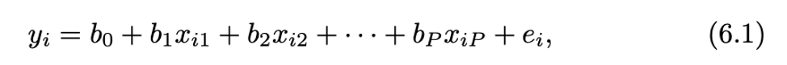
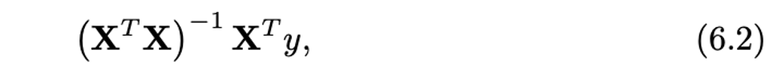
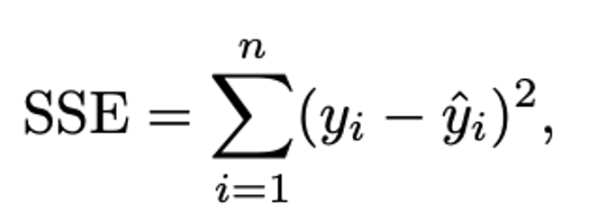
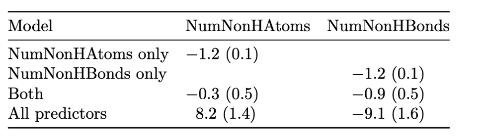
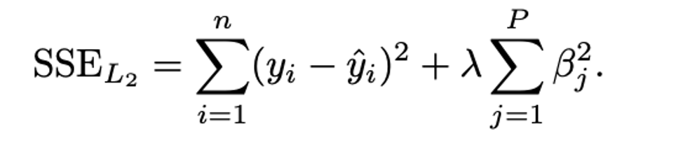
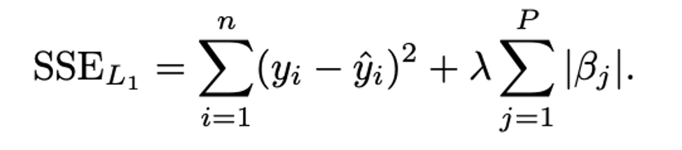
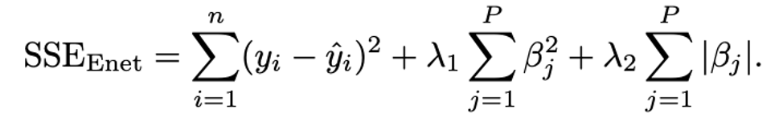

```{r setup, include=FALSE}
knitr::opts_chunk$set(echo = FALSE)
```

# Chapter 5
.medium[
* quantitative measures
  * RMSE
      + root mean squared error
  * $R^2$ 
      + coefficient of determination
      + describing correlation not accuracy
      + dependent on the variation of the outcome
      $$R^2 = 1 - \frac{n * MSE}{TSE} = 1 - \frac{RMSE^2}{\frac{\sum_{i=1}^k (y_i - \overline{y_i})^2}{n}}$$ 
]

---

# Chapter 5
.medium[
* the Variance-Bias Trade-off
$$E[MSE] = 	\sigma^2 + (Model Bias)^2 + Model Variance$$
    + variance
    + bias
]

---

# Chapter 6
## Linear Regression family
.medium[
*  ordinary linear regression
    * highly interpretable
    * when residuals meet certain distributional assumptions, we can compute standard errors of the coefficients
    * if relationship not falls along a hyperplane, need augmentation
    * no predictor can be determined from a combination of one or more other predictiors
    * the number of samplers > the number of predictors
]
```{r, echo=FALSE, out.height='80px', fig.align='center'}

```
```{r, echo=FALSE, out.height='60px', fig.align='center'}

```
---

# Chapter 6
## Linear Regression family
.medium[
*  ordinary linear regression
    * if use SSE, prone to chasing observations that are awy from the overall trend,can use absolute, Huber...
    * between-predictor relationship would cause instable in the regression
]
```{r, echo=FALSE, out.height='80px', fig.align='center'}

```
```{r, echo=FALSE, out.height='150px', fig.align='center'}

``` 

---
# Chapter 6
## Linear Regression family
.medium[
*   PLS vs PCA
    *  PCA: unsupervised, maximally summarize the variability of predictors
    *  PLS: supervised, maximally summarize the covariance with reponse 
]

---
# Chapter 6 
.medium[
*   penalized models
    *  ridge: does not shrink to zero,conduct no feature selection, shrink the coef of correlated predictors towards each other
    *  lasso: shrink to zero, conduct feature selection, will tend to pick one among correlated predictors
    *  elastic net: regularization via ridge and conduct feature selection by lasso part
]
```{r, echo=FALSE, out.height='100px', fig.align='center'}

```
```{r, echo=FALSE, out.height='100px', fig.align='center'}

``` 
```{r, echo=FALSE, out.height='100px', fig.align='center'}

``` 

