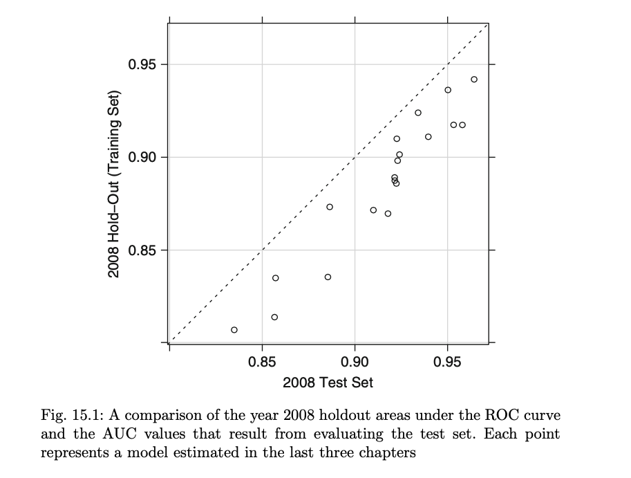
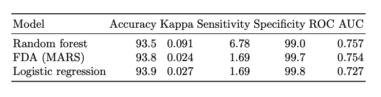
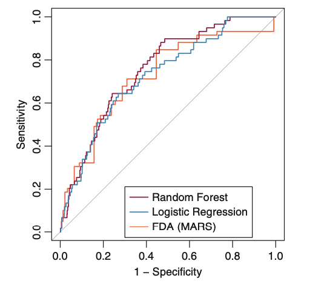
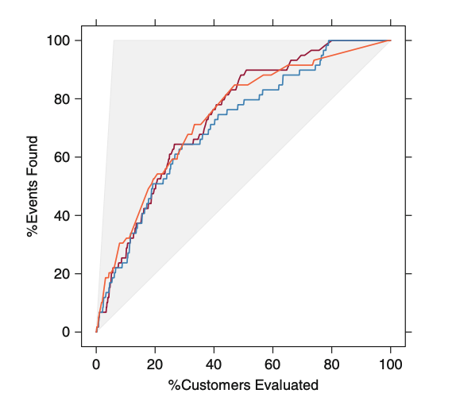
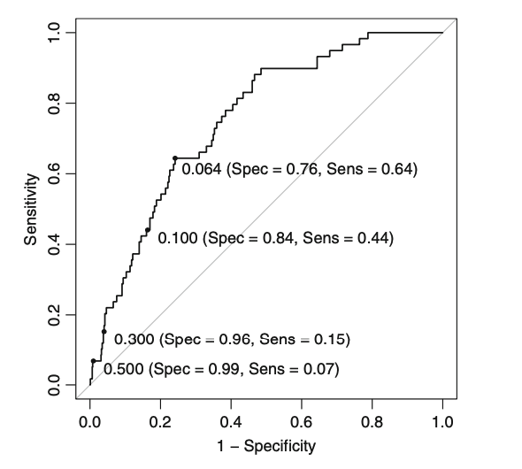
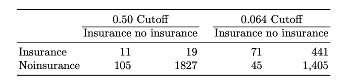
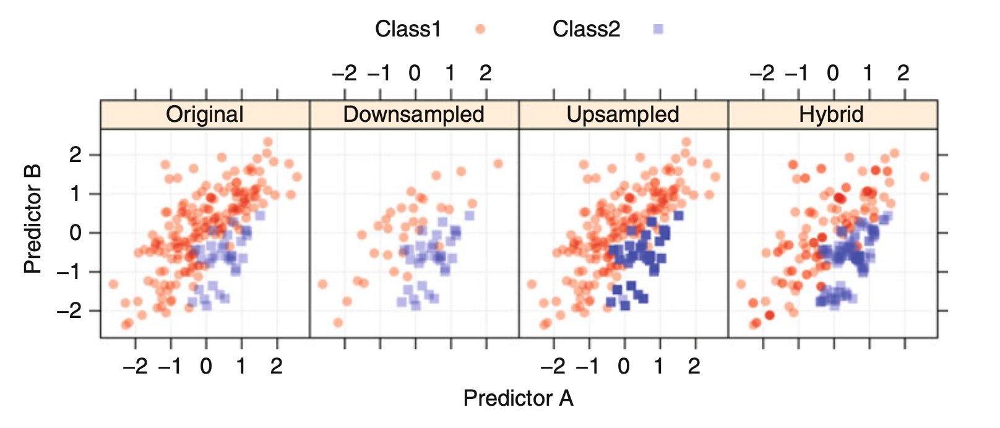
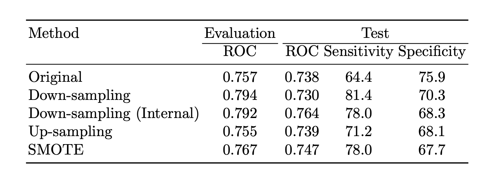

```{r setup, include=FALSE}
knitr::opts_chunk$set(echo = TRUE)
```

# Chapter 15: Grant Application Models Summary

```{r, echo=FALSE, out.height='400px', fig.align='center'}

```
>The correlation between the two estimates is high (0.96), although the tuning holdout set was more pessimistic than the test set.


---
# Chapter 16: Remedies for Severe Class Imbalance

.large[
* When modeling discrete classes, the relative frequencies of the classes can have a significant impact on the effectiveness of the model.
* An imbalance can be present in any data set or application, and hence, the practitioner should be aware of the implications of modeling this type of data.
]

---
# Case Study: Predicting Caravan Policy Ownership

.medium[
The 2000 CoIL Challenge: to predict whether customers would purchase caravan insurance.
* The outcome, whether the costumer purchased caravan insurance, is highly unbalanced with only 6%
* Customer subtype designation, such as “Traditional Families” or “Affluent Young Families.” Many of the subtypes comprise less than 5 % of the customers.
* Demographic factors were derived from data at the zip code level.
* Three data set were created using stratidied random sampling. A training set, A small evaluation set, And a test set.
]


---
# Effect of Class Imalance

```{r, echo=FALSE, out.height='190px', fig.align='center'}

```

.medium[
* In each model, any patterns that were useful for predicting the outcome were overwhelmed by the large percentage of customers with no caravan insurance.
* All models achieved good specificity, but high sensitivity (where a policy perchase is defined as the event).
* All models had highly left-skewed predicted probablility distributions.

]

---
# Effect of Class Imalance




.medium[
* There is a strong similarity between the lift and ROC curves. This is an artifact of severe class imbalance.
* When the classes are more balanced, the curves are unlikely to have similar patterns.
]

---
# Model Tuning

.medium[
* The simplest approach to counteract the effects of class imbalance is to tune the model to maximize the accuracy of the minority class(es).
* Tuning the model to maximize the sensitivity may help desensitize the training process to the high percentage without a policy purchase.
* The FDA model showed a rise in sensitivity from 0% to 5.4% as the model terms were increased. This is a minor improvment with no cost to specificity.
* Given the slight sensitivity increase this in not an effective solution.
]

---
# Alternate Cutoffs
```{r, echo=FALSE, out.height='300px', fig.align='center'}

```
.medium[
* An appropriate balance between sensitivity and specificity can be determinded.
* Decreasing the cutoff for the probability of respondings increases the sensitivity at the cost of specificity.
* There may be situations where the sensitivity/specificity trade-off can be accomplished without severely compromising the accuracy of the majority class.
]

---
# Alternate Cutoffs

.medium[
Several techniques exist for determining a new cutoff
* If there is a particular target that must be met for the sensitivity or specificity, this point can be found on the ROC curve and the corresponding cutoff can be determined.
* Find the point on the ROC curve that is closest (the shortest distance) to the perfect model.
* Using Youden's *J* index which measures the proportion of the correctly predicted samples for both groups. This can be computed at every cutoff that is used to create the ROC.
]
```{r, echo=FALSE, out.height='160px', fig.align='center'}

```

---
# Adjusting Prior Probabilities

.medium[
* Some models use prior probabilities, such as na ̈ıve Bayes and discriminant analysis classifiers.
* These models typically derive the value of the priors from the training data.
* Using more balanced priors or a balanced training set may help deal with a class imbalance.
* For example, new priors of 60 % for the insured and 40 % for the uninsured in the FDA model increased the probability of having insurance significantly. However the new class probabilites did not change the rankings of customers in the test set and the model has the same area under the ROC.
]

---
# Unequal Case Weights
.large[
* One approach to rebalancing the training set would be to increase the weights for the samples in the minority classes.
* Many models doing this can be interpreted as having identical duplicate points with the same predictor values.
]

---
# Sampling Methods
.medium[
* When there is *a priori* knowledge of a class imbalance, select a training set sample to have roughly equal event rates during the initial data collection.
* The test set should be sampled to be more consistent with the state of nature and should reflect the imbalance so that honest estimates of future performance can be computed.
* *Up-sampling* is any technique that simulates or imputes additional data points to improve balance across classes.
* *Down-sampling* is any technique that reduces the number of samples to improve the balance across classes.
]

---
# Up Sampling
.medium[
* Cases from the minority classes are sampled with replacement until each class has approximately the same number.
* In doing this, some minority class samples may show up in the training set with a fairly high frequency while each sample in the majority class has a single realization in the data.
* This is very similar to the case weight approach with varying weights per case.
]

---
# Down Sampling
.medium[
* Basic approach is to randomly sample the majority classes so that all classes have approximately the same size.
* Another approach is to take a bootstrap sample across all cases such that the classes are balanced in the bootstrap set.
* Random forests can inherently down-sample by controlling the bootstrap sampling process within a stratification variable.
* These internally down-sampled versions of the training set are then used to construct trees in the ensemble.
]

---
# SMOTE
.medium[
* The synthetic minority over-sampling technique (SMOTE) uses both up-sampling and down-sampling, depending on the class.
* While the SMOTE algorithm adds new samples to the minority class via up-sampling, it also can down-sample cases from the majority class via random sampling in order to help balance the training set.
* SMOTE takes the amount of up-sampling, the amount of down-sampling, and the number of neighbors that are used to impute new cases as parameters.
* When using modified versions of the training set, resampled estimates of model performance can become biased.
]

---
# Sampling Methods

```{r, echo=FALSE, out.height='250px', fig.align='center'}

```
```{r, echo=FALSE, out.height='250px', fig.align='center'}

```
---
# Cost-Sensitive Training
.medium[
* Some models can alternatively optimize a cost or loss function that differentially weights specific types of errors.
* Incorporation of specific costs during model training may bias the model towards less frequent classes.
* For SVM models costs can be associated with specific classes.
* Unequal costs can affect the model parameters and thus have the potential to make true improvements to the classifier.
* One consequence of this approach is that class probabilities cannot be generated for the model.
* Kappa statistic, sensitivity, and specificity will be used to evaluate the impact of weighted classes.
]

---
# Cost-Sensitive Training

