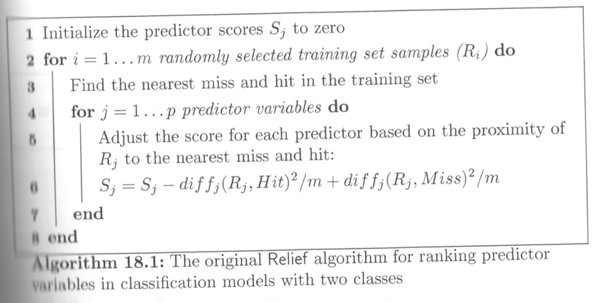

```{r setup, include=FALSE}
knitr::opts_chunk$set(echo = FALSE)
```

# Chapter 17 - Case Study
.large[
HPC Job Scheduling
* Problem: Execute simultaneous jobs in an effcient manner
* Challenges
    * demand exceeds capacity
    * Spikey job submission
    * Job priority can vary
    * Various machine specs
    * Imbalance in the information about the job
]

---
# Chapter 17 - Setup
```{r, echo=FALSE, out.height='500px', fig.align='center'}
knitr::include_graphics('Ch17Fig01.png')
```
---
# Objective
.pull-left[
.large[
Predict the job class
* very fast 51%
* fast 31%
* moderate 12% 
* long 6%
]
]

.pull-right[
```{r, echo=FALSE, out.height="300px", fig.align='center'}
knitr::include_graphics('Ch17Fig02.png')
```
]

---

# Data Splitting
.large[
* 4331 samples (80/20 split)
* Stratified random sampling
* five repeats, 10-fold CV
* Custom cost fuction (p 453 Table 17.2)
]
---

# Model Classes
.large[
* LDA (standard and penalized)
* PLS
* NN (Single hidden layer)
* FDA (First degree MARS)
* SVM - RBF (equal and weighted costs)
* CART (equal and weighted costs)
* Bagged CART (equal and weighted costs)
* RF
* C5.0 (Tree and rule-based models)
]

---
# Results

```{r, echo=FALSE, out.height='450px', fig.align='center'}
knitr::include_graphics('Ch17Fig05.png')
```
.large[
Linear models did poorly, the rest were about the same
]
---
# Results - CART
.large[
Equal/Unequal costs did not have an effect on complexity parameter.

Cost model caused a decrease in accuracy and Kappa]
```{r, echo=FALSE, out.height='300px', fig.align='center'}
knitr::include_graphics('Ch17Fig06a.png')
```
---
# Results - SVM
.large[
Equal/Unequal weights did not have an effect on the Cost

Cost model had limit effect on accuracy and Kappa
]
```{r, echo=FALSE, out.height="300px", fig.align='center'}
knitr::include_graphics('Ch17Fig06b.png')
```
---

# Chapter 18
## Measuring Predictor Importance
.large[
* Goal: Quantify the strength of the relationship between the predictors and the outcome.
* Rational: Filter inputs to the model
* Some models have built-in measurements
  * Trees, MARS, LinReg/LogReg
* This chapter focuses on model agnostic approaches
* Techniques are generally divided by type of outcome
]

---
# Numerical Outcomes and Predictors
.large[
* Correlation
  * Classical approach
  * Measures linear association - which can be limiting
* Spearman's Ranked Correlation
  * Use when the data is curvilinear
* LOESS Pseudo- $R^2$
  * fits a local polynomial through the data
  * Use a pseudo- $R^2$ on the residuals
* Maximal Information Coefficient
]
---
# Numerical Outcomes and Predictors
.large[
* Univariate miss correlated variables
  * Some models may be sensitive to this
  * Preprocess to remove them
* Univariate do not account for interactions
  * Generally expert knowledge is needed
]
---
# Num. Outcomes - Cat. Predictors
.large[
* Are average outcomes in a category different
  * Use a t-statistic to test
* Wilcoxon rank sum test
  * If the t-stat assumptions are violated
* ANOVA
  * When there are more than 2-categories
]
---
# Cat. Outcomes - Num. Predictors
.large[
* ROC-AUC
  * Build a single feature model (??)
  * Supported when there are two classes
    * A one-vs-all approach would work
* Mean values of predictors within a class
  * Predictor is treated as the outcome
]

---
# Categorial Outcomes and Predictors
.large[
* Two class problem
  * Odds of probability $p/(1-p)$
    * odds ratio = $\frac{p_1(1-p_2)}{p_2(1-p_1)}$
  * Fisher's Exact Test
* Multiclass problem
  * C4.5 Gain ratio (bigger is better)
]

---
# Relief Algo
.large[
* Generic method
* Two class
* Continuous and dummy predictors
* Recognizes nonlinear relationships
]

---
# Relief Algo
```{r, echo=FALSE, out.height="500px", fig.align='center'}

```
---

# Relief Algo
```{r, echo=FALSE, out.height="300px", fig.align='center'}
knitr::include_graphics('Ch18Fig08.png')
```

.medium[
.pull-left[
* Sample update
  1. Start with the second last point on the left
  1. Predictor A = -1.1
  1. Nearest hit: 0.2 units away
  1. Nearest miss: at 0.5
]
.pull-right[
* Update: $\frac{-(-1.1 + 0.9)^2 + (-1.1 - 5)^2}{m} = \frac{2.55}{m}$
* Predictor B is non-informative
]
]
---

# ReliefF Algo
.large[
* Improvement to Relief
  * Uses more than one nearest neighbor
  * Modified distance metric
  * Supports more than two classes
]
---

# Maximal Information Coefficient (MIC)
.large[
* Quantifies the relationship between two variables
* Create a grid of two features
* Partition the data into a set of grids
* Within each grid, compute mutual information statistic
* Repeat the process for many different grid sizes
* The mutual information values are normalized
* The largest value is used as the strength of association between the predictor and outcome.
]
