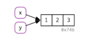
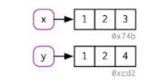
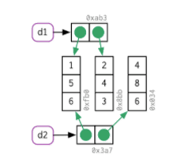
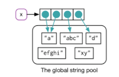
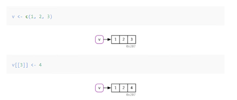
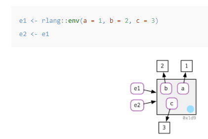
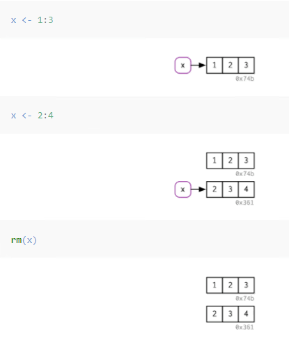
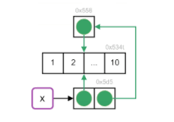

<style type="text/css">

body, td {
   font-size: 14px; 
}
code.r{
  font-size: 12px;
}
pre {
  font-size: 12px;
  background-color:lightblue;
}
</style>
```{r setup, include=FALSE}
knitr::opts_chunk$set(echo = TRUE)
library(lobstr)
```

# Chapter 1 - Introduction
.large[
who should read this book
* Intermediate R programmer

What you will get out of this book
* Be familiar with the foundations of R
* Understand what functional programming mean
* Know about R’s rich variety of object-oriented systems
* Appreciate the double-edged sword of metaprogramming
* Have a good intuition for which operations in R are slow or use a lot of memory. 
]

---
# Chapter 2.2 -  Binding basics
.large[
* think of a name as a reference to a value. 
* you don’t get another copy of the value c(1, 2, 3), you get another binding to the existing object
]

```{r }
x <- c(1, 2, 3)
y <- x
obj_addr(x) 
obj_addr(y) 
```
.pull-left[
```{r, echo=FALSE, out.height="100px", fig.align='left'}

```
]

---
# Chapter 2.3 -  Copy-on-modify
.large[
* While the value associated with y changed, the original object did not. Instead, R created a new object, 0xcd2, a copy of 0x74b with one value changed, then rebound y to that object.
]

```{r }
x <- c(1, 2, 3)
y <- x

y[[3]] <- 4
x 
```
.pull-left[
```{r, echo=FALSE, out.height="100px", fig.align='left'}

```
]
---
# Chapter 2.3.3 -  Lists
.large[
* This list is more complex because instead of storing the values itself, it stores references to them
]

```{r }
l1 <- list(1, 2, 3)
l2 <- l1
l2[[3]] <- 4
ref(l1, l2)
```
.pull-left[
```{r, echo=FALSE, out.height="100px", fig.align='left'}
knitr::include_graphics('Picture3.png')
```
]
---
# Chapter 2.3.4 -  Data frames
.large[
* Data frames are lists of vectors, so copy-on-modify has important consequences when you modify a data frame
]

```{r }
d1 <- data.frame(x = c(1, 5, 6), y = c(2, 4, 3))
d2 <- d1
d2[, 2] <- d2[, 2] * 2 
```
.pull-left[
```{r, echo=FALSE, out.height="200px", fig.align='left'}

```
]
---
# Chapter 2.3.4 -  Character vectors
.large[
* R actually uses a global string pool where each element of a character vector is a pointer to a unique string in the pool
]

```{r }
x <- c("a", "a", "abc", "d")
ref(x, character = TRUE)
```
.pull-left[
```{r, echo=FALSE, out.height="200px", fig.align='left'}

```
]
---
# Chapter 2.4 -  Object size
.medium[
* Since the elements of lists are references to values, the size of a list might be much smaller than you expect
*  R 3.5.0 and later versions have a feature that might lead to surprises: ALTREP, short for alternative representation.  
]

```{r }
x <- runif(1e6)
obj_size(x) 
y <- list(x, x, x)
obj_size(y) 
obj_size(1:3) 
obj_size(1:1e3) 
obj_size(1:1e6) 
obj_size(1:1e9) 
```
```{r }
```
---

# Chapter 2.5 -  Modify-in-place
.Large[
* Objects with a single binding get a special performance optimisation
* Environments, a special type of object, are always modified in place. 
]

.pull-left[
```{r, echo=FALSE, out.height="200px", fig.align='left'}
 
```
]
.pull-left[
```{r, echo=FALSE, out.height="200px", fig.align='left'}

```
]
---
# Chapter 2.6 -  Unbinding and garbage collector
.Large[
*  The GC frees up memory by deleting R objects that are no longer used, and by requesting more memory from the operating system if needed. 
]

.pull-left[
```{r, echo=FALSE, out.height="300px", fig.align='left'}
 
```
] 
---
# Exercise -  2.2
.Large[
*  The following code accesses the mean function in multiple ways. Do they all point to the same underlying function object? Verify this with lobstr::obj_addr().
]
```{r 2.2.2* exercises }
mean_functions <- list(mean,
                       base::mean,
                       get("mean"),
                       evalq(mean),
                       match.fun("mean"))

unique(obj_addrs(mean_functions))  
```
---

# Exercise -  2.5
.Large[
*  Explain why the following code doesn’t create a circular list.
]
```{r 2.5* exercises }
x <- list()  # creates initial object
obj_addr(x) 
tracemem(x) 
x[[1]] <- x  # Copy-on-modify triggers new copy 
obj_addr(x)       # copied object has new memory address 
obj_addr(x[[1]])  # list element contains old memory adress 
```
---
.pull-center[
```{r, echo=FALSE, out.height="250px", fig.align='center'}
 
```
] 
---
 
