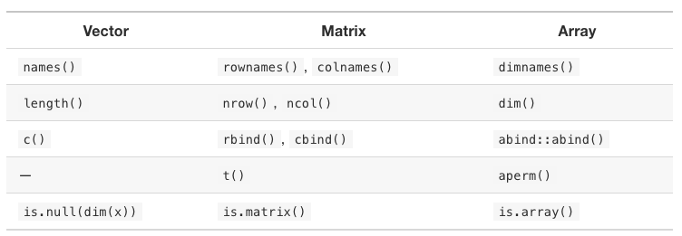

```{r setup, include=FALSE}
knitr::opts_chunk$set(echo = FALSE)
library(lobstr)
library(tibble)
```

# Vectors

* Flavours: 
  * atomic: all elements are the same type
  * list: elements can have different types
  * NULL: not a vector but serves as an empty vector
    
* Attributes:
  * Stores metadata about the vector
  
---
# Atomic Vectors

* Types:
  * Logical: `TRUE`, `FALSE`
  * Integer: `1234L`, `1E4L`, `0xcafeL`
  * Double: `0.1234`, `1.23E4`, `0xcafe`, `Inf`, `-Inf`, `NaN`
  * Character: Strings, may need escaping
  * Raw: Used for binary
  * Complex: `complex(real=5, imaginary=2)`

* `typeof()` returns the vector type
    
---

# Greedy `NA`
  
.pull-left[
## Greedy `NA`
```{r, echo=TRUE}
NA > 5
10 * NA
!NA
c(NA, 5, NA, 10) == NA
```
]

.pull-right[
## Exceptions to Greedy `NA`
```{r, echo=TRUE}
NA^0
NA | TRUE
NA & FALSE
```
]

* use `is.na(x)` to determine if something is NA
---
# Coercion

* R will coerce vectors into a common data type
* LOGICAL -> Integer -> Double -> Character
  * We are increasing the domain of possible values as we move to the right
  * A warning is generated when it cannot coerce
* manual coercion use: `as.*()` methods where * is the type
  * `as.integer()`, `as.logical()`, `as.double()`, etc.

```{r, echo=TRUE}
c("a", 1)

x <- c(FALSE, FALSE, TRUE)
mean(x)
as.integer(c("1", "1.5", "1.6", "a"))
```
---
# Attributes

* Data structures like, matrices, arrays, factors, dates etc. are built on the atomic vectors with the use of attributes.
* attributes provide meta-data about a vector
* attributes are name-value pairs
* most attributes are lost on mutation

Accessing and mutating attributes
* `attribute(x)`: returns all attributes of `x`
* `attributes(a) <- list(a='foo', b='bar')`: resets all attributes
* `attr(x, "y")`: returns the attribute "y" of `x`
* `attr(x, "y") <- 3`: sets the attribute "y" to the value 3, in `x`

---
# Assign Attributes at creation

Setting attributes at creation
```{r, echo=TRUE}
a <- structure(
  1:3,
  x = "abc",
  y = 4:6
)
str(attributes(a))
```

---
# Special Attributes

* Attributes `class`, `comment`, `dim`, `dimnames`, `names`, `row.names` and `tsp` have restrictions on their values.
* There are helper functions to work with these. `names()`, `row.names()`, etc.
* `attributes(a) <-` gives an error if the rules are violated
* `mostattributes(a) <-` only mutates these attributes if they are valid.

The `NULL` object cannot have attributes
```{r, echo=TRUE}
tryCatch(
  {attr(NULL, 'foo') <- 'bar'},
  error = function(e) {
    print(e$message)
  })
```

---

# Attribute Functions



---

# Methods for Naming Vectors

```{r, echo=TRUE}
# In creation
x <- c(a = 1, b = 2, c = 3)

# Assignment
names(x) <- c("a", "b", "c")

# Inline
x <- setNames(1:3, c("a", "b", "c"))
```

---
  
# Dimensions

```{r, echo=TRUE}
c <- 1:6
print(c)

# Set the dimensions
dim(c) <- c(3,2)
print(c)
```

---

# S3 Vectors

* An object with a `class` attribute makes it an S3 object

```{r, out.height='500px', fig.align='center'}
knitr::include_graphics('s3.png')
```

---

# Factors

```{r, echo=TRUE}
x <- factor(c("a", "b", "c"), levels = c("a", "b", "c", "d", "e"))
x
typeof(x)
attributes(x)
```

---

# Dates and Date-time

* Both are based on a `double`

## Dates 
* number of days since the Linux Epoc of Time
```{r, echo=TRUE}
date <- as.Date("1970-02-01")
unclass(date)
```

## Date-time
* `POSIXct` is `time_t` in C
* `POSIXlt` is `struct tm` in C
```{r, echo=TRUE}
now_ct <- as.POSIXct("2020-09-26 22:00", tz = 'UTC')
structure(now_ct, tzone = 'America/New_York')
```

---

# Lists

* Each element can have any data type
* Each element must be of the same type

```{r, echo=TRUE}
lobstr::obj_size(mtcars)
lobstr::obj_size(list(mtcars, mtcars, mtcars))
```

---

# Data frames and tibbles

* tibbles are lazy and surly data frames
* data frames coerce strings to factors, tibbles do not
* data frames transform non-syntactic names, tibbles do not.
```{r, echo=TRUE}
names(data.frame(`1` = 1))
names(tibble(`1` = 1))
```
* data frames recycle values, tibbles only do this when the length is 1
```{r, echo=TRUE}
tryCatch({tibble(x=1:4, y=1:2)}, error = function(e) {cat(e$message)})
```

---

# Row names

* tibbles have deprecated row names
* use `rownames` to move a data frame row names into a tibble column
```{r, echo=TRUE}
df <- data.frame(age=c(35, 27, 18), hair=c('blond', 'brown', 'black'))
row.names(df) <- c('Bob', 'Susan', 'Sam')
as_tibble(df, rownames = "name")
```
* tibbles do a better job of printing
* tibbles do not do partial matching on `$`
* tibbles can hold lists, tibbles, and matrices 

---

# `NULL`

* length is always 0
```{r, echo=TRUE}
length(NULL)
```
* does not contain attributes
```{r, echo=TRUE}
attributes(NULL)
```
* `c()` returns `NULL`
* `NULL` is used to remove elements from a list
```{r, echo=TRUE}
A <- list(a=1, b=1)
A$a <- NULL
A
```

---

