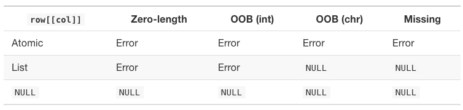

<style>
pre {
    display: block;
    font-family: monospace;
    white-space: pre;
    margin: 1em 0px;
    margin-top: 0em;
    margin-right: 0px;
    margin-bottom: 0em;
    margin-left: 0px;
}
</style>

```{r setup, include=FALSE}
knitr::opts_chunk$set(echo = FALSE)
library(lobstr)
library(tibble)
```

# Vectors

* Flavours: 
  * atomic: all elements are the same type
  * list: elements can have different types
  * NULL: not a vector but serves as an empty vector
    
* Attributes:
  * Stores metadata about the vector
  
---
# Atomic Vectors

* Types:
  * Logical: `TRUE`, `FALSE`
  * Integer: `1234L`, `1E4L`, `0xcafeL`
  * Double: `0.1234`, `1.23E4`, `0xcafe`, `Inf`, `-Inf`, `NaN`
  * Character: Strings, may need escaping
  * Raw: Used for binary
  * Complex: `complex(real=5, imaginary=2)`

* `typeof()` returns the vector type
    
---

# Greedy `NA`
  
.pull-left[
## Greedy `NA`
```{r, echo=TRUE}
NA > 5
10 * NA
!NA
c(NA, 5, NA, 10) == NA
```
]

.pull-right[
## Exceptions to Greedy `NA`
```{r, echo=TRUE}
NA^0
NA | TRUE
NA & FALSE
```
]

* use `is.na(x)` to determine if something is NA
---
# Coercion

* R will coerce vectors into a common data type
* LOGICAL -> Integer -> Double -> Character
  * We are increasing the domain of possible values as we move to the right
  * A warning is generated when it cannot coerce
* manual coercion use: `as.*()` methods where * is the type
  * `as.integer()`, `as.logical()`, `as.double()`, etc.

```{r, echo=TRUE}
c("a", 1)

x <- c(FALSE, FALSE, TRUE)
mean(x)
as.integer(c("1", "1.5", "1.6", "a"))
```
---
# Attributes

* Data structures like, matrices, arrays, factors, dates etc. are built on the atomic vectors with the use of attributes.
* attributes provide meta-data about a vector
* attributes are name-value pairs
* most attributes are lost on mutation

Accessing and mutating attributes
* `attribute(x)`: returns all attributes of `x`
* `attributes(a) <- list(a='foo', b='bar')`: resets all attributes
* `attr(x, "y")`: returns the attribute "y" of `x`
* `attr(x, "y") <- 3`: sets the attribute "y" to the value 3, in `x`

---
# Assign Attributes at creation

Setting attributes at creation
```{r, echo=TRUE}
a <- structure(
  1:3,
  x = "abc",
  y = 4:6
)
str(attributes(a))
```

---
# Special Attributes

* Attributes `class`, `comment`, `dim`, `dimnames`, `names`, `row.names` and `tsp` have restrictions on their values.
* There are helper functions to work with these. `names()`, `row.names()`, etc.
* `attributes(a) <-` gives an error if the rules are violated
* `mostattributes(a) <-` only mutates these attributes if they are valid.

The `NULL` object cannot have attributes
```{r, echo=TRUE}
tryCatch(
  {attr(NULL, 'foo') <- 'bar'},
  error = function(e) {
    print(e$message)
  })
```

---

# Attribute Functions


---

# Methods for Naming Vectors

```{r, echo=TRUE}
# In creation
x <- c(a = 1, b = 2, c = 3)

# Assignment
names(x) <- c("a", "b", "c")

# Inline
x <- setNames(1:3, c("a", "b", "c"))
```

---
  
# Dimensions

```{r, echo=TRUE}
c <- 1:6
print(c)

# Set the dimensions
dim(c) <- c(3,2)
print(c)
```

---

# S3 Vectors

* An object with a `class` attribute makes it an S3 object

```{r, out.height='500px', fig.align='center'}
knitr::include_graphics('s3.png')
```

---

# Factors

```{r, echo=TRUE}
x <- factor(c("a", "b", "c"), levels = c("a", "b", "c", "d", "e"))
x
typeof(x)
attributes(x)
```

---

# Dates and Date-time

* Both are based on a `double`

## Dates 
* number of days since the Linux Epoc of Time
```{r, echo=TRUE}
date <- as.Date("1970-02-01")
unclass(date)
```

## Date-time
* `POSIXct` is `time_t` in C
* `POSIXlt` is `struct tm` in C
```{r, echo=TRUE}
now_ct <- as.POSIXct("2020-09-26 22:00", tz = 'UTC')
structure(now_ct, tzone = 'America/New_York')
```

---

# Lists

* Each element can have any data type
* Each element must be of the same type

```{r, echo=TRUE}
lobstr::obj_size(mtcars)
lobstr::obj_size(list(mtcars, mtcars, mtcars))
```

---

# Data frames and tibbles

* tibbles are lazy and surly data frames
* data frames coerce strings to factors, tibbles do not
* data frames transform non-syntactic names, tibbles do not.
```{r, echo=TRUE}
names(data.frame(`1` = 1))
names(tibble(`1` = 1))
```
* data frames recycle values, tibbles only do this when the length is 1
```{r, echo=TRUE}
tryCatch({tibble(x=1:4, y=1:2)}, error = function(e) {cat(e$message)})
```

---

# Row names

* tibbles have deprecated row names
* use `rownames` to move a data frame row names into a tibble column
```{r, echo=TRUE}
df <- data.frame(age=c(35, 27, 18), hair=c('blond', 'brown', 'black'))
row.names(df) <- c('Bob', 'Susan', 'Sam')
as_tibble(df, rownames = "name")
```
* tibbles do a better job of printing
* tibbles do not do partial matching on `$`
* tibbles can hold lists, tibbles, and matrices 

---

# `NULL`

* length is always 0
```{r, echo=TRUE}
length(NULL)
```
* does not contain attributes
```{r, echo=TRUE}
attributes(NULL)
```
* `c()` returns `NULL`
* `NULL` is used to remove elements from a list
```{r, echo=TRUE}
A <- list(a=1, b=1)
A$a <- NULL
A
```

---

# Subsetting Vectors

```{r, echo=TRUE}
x <- 5:10
```
## Real numbers are silently truncated
```{r, echo=TRUE}
x[c(2.1, 2.9)]
```

## Cannot mix - and + indices
```{r, echo=TRUE}
tryCatch({x[c(-1,2)]}, error = function(e) {cat(e$message)})
```

## `NA` gives `NA`
```{r, echo=TRUE}
x[c(TRUE, TRUE, NA, TRUE, TRUE)]
```

---

# Data Frame vs Tibble Selection

## Data Frame list subsetting 
```{r, echo=TRUE}
df <- data.frame(x = 1:3, y = 3:1, z = letters[1:3])
str(df["x"])
```

## Data Frame matrix subsetting
```{r, echo=TRUE}
str(df[, "x"])
```

## Tibble matrix subsetting
```{r, echo=TRUE}
str(as_tibble(df)[, "x"])
```
Tibbles always return a Tibble

---

# Selecting a single element
```{r,echo=TRUE}
x <- list(1:3, "a", 4:6)
```
```{r, echo=FALSE}
knitr::include_graphics('train.png')
```
```{r,echo=TRUE}
typeof(x[1])
```
```{r,echo=TRUE}
typeof(x[[1]])
```
```{r, echo=FALSE}
knitr::include_graphics('train-single.png')
```

---

# Advice on `[[`

* `[[` and `$` operators extract single elements
* `x$y` is short hand for `x[[y]]`
* `[[` can only return a single item
  * `x[[c(1,2)]]` is the same as `x[[1]][[2]]`
* `[[` must be used to access an element in a list
* vectors can use `[` to access an element
* It is recommended that `[[` is also used for vectors

---

# Missing and out-of-bounds indices

```{r, echo=FALSE}

```
* Avoid these inconsistencies by using `purrr::pluck()` and `purrr::chuck()`
* `purrr::pluck()` always returns `NULL` or the value set with `.default=`
* `purrr:chuck()` always throws an error

.pull-left[
```{r, echo=TRUE}
x <- list(a=list(1,2,3), b=list(3,4,5))
purrr::pluck(x, 'a')
```
]

.pull-right[
```{r, echo=TRUE}
purrr::pluck(x, 'b', 2)
```

```{r, echo=TRUE}
purrr::pluck(x, 'c', .default = NA)
```
]

---

# Subassignment

* All subsetting operators can be combined with assignment
```{r, echo=TRUE}
x <- 1:5
x[c(3,4)] <- c(101, 102)
x
```
* `lapply()` always returns a list but we can get a data frame with
```{r, echo=TRUE}
mtcars[] <- lapply(mtcars, as.integer)
is.data.frame(mtcars)
```

* `x[[i]] <- NULL` deletes an element of a list
* `x[[i]] <- list(NULL)` stores a literal `NULL`

---

# Questions

1. How do you create raw and complex scalars? Hint: ?raw and ?complex. (Ex 3.2.5 #1 p45) 
1. Why is the default missing value, `NA`, a logical vector? What's special about logical vectors? Hint: think about `c(FALSE, NA_character_)`. (Ex 3.2.5 #4 p45)
1. Precisely what do `is.atamic()`, `is.numeric()`, and `is.vector()` test for? (Ex 3.2.5 #5 p45)
1. How would you describe the following three objects? What makes them different from `1:5`? (Ex 3.3.4 #3 p49)
  ```{r, echo=TRUE, eval=FALSE}
  x1 <- array(1:5, c(1, 1, 5))
  x2 <- array(1:5, c(1, 5, 1))
  x3 <- array(1:5, c(5, 1, 1))
  ```
5. An early draft used this code to illustrate `structure()`:
  ```{r, echo=TRUE}
  structure(1:5, comment = 'my attribute')
  ```
But when you print that object you do not see the comment attribute. Why? Is the attribute missing, or is there something else special about it? Hint: try using help. (Ex 3.3.4 #4 p49)

---

# Questions

1. What happens to a factor when you modify its levels? (Ex 3.4.5 #2 p55)
  ```{r, echo=TRUE, eval=FALSE}
  f1 <- factor(letters)
  levels(f1) <- rev(levels(f1))
  ```
1. What does this code do? How do `f2` and `f3` differ from `f1`? (Ex 3.4.5 #3 p55)
  ```{r, echo=TRUE, eval=FALSE}
  f2 <- rev(factor(letters))
  f3 <- factor(letters, levels = rev(letters))
  ```
1. List all the ways that a list differs from an atomic vector. (Ex 3.5.4 #1 p58)
1. What happens if you attempt to set row names, on a data frame, that are not unique? (Ex 3.6.8 #2 p69)
1. Why does the following code yield five missing values? Hint: why is it different from `x[NA_real_]`? (Ex 4.2.6 #2 p81)
  ```{r, echo=TRUE}
  x <- 1:5
  x[NA]
  ```
1. What does `df[is.na(df)] <- 0` do? How does it work? (Ex 4.2.6 #6 p81) 

---

# Questions

1. Brainstorm as many ways as possible to extract the third value from the `cyl` variable in the `mtcars` dataset. (Ex 4.3.5 #1 p85)
1. How would you randomly permute the columns of a data frame? Can you simultaneously permute the rows and columns in one step? (Ex 4.5.9 #1 p94)