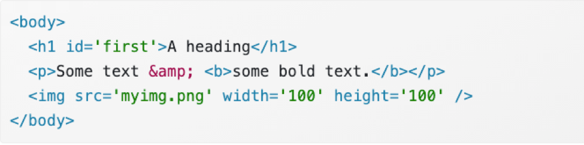
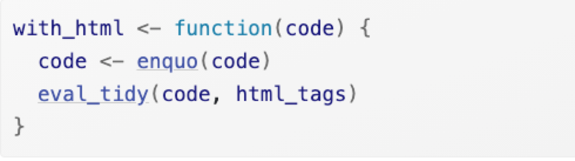
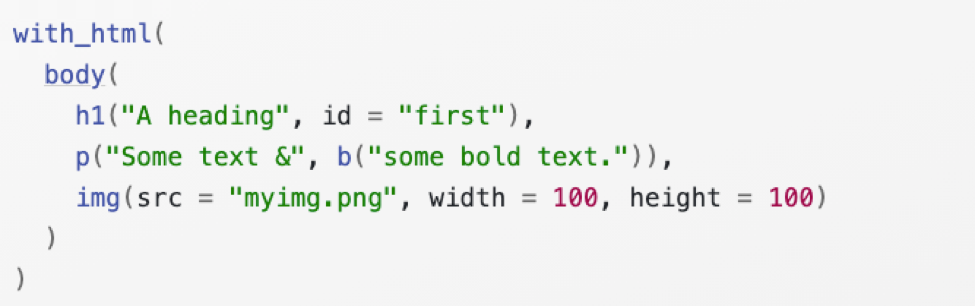

<style>
pre {
    display: block;
    font-family: monospace;
    white-space: pre;
    margin: 1em 0px;
    margin-top: 0em;
    margin-right: 0px;
    margin-bottom: 0em;
    margin-left: 0px;
}
</style>

```{r setup, include=FALSE}
knitr::opts_chunk$set(echo = FALSE)
library(lobstr)
library(tibble)
library(rlang)
library(purrr)
```

# Evaluation

* `quosure` data structure includes both expression and its associated env
* `data mask` makes it easier to evaluate an expression in the context of a data frame 
* `eval()` has two arguments: `expr` and `envir` 
```{r, echo=TRUE}
x <- 10
y <- 2
# first argument is evaluated, not quoted
# env override is not working
eval(print(x+1), env(x = 1000))
# manually quote
# env override is working
eval(expr(print(x+1)), env(x = 1000))
```
---

# Function
* functions print their `srcref` attribute
* because `srcref` is a base R feature it’s unaware of `quasiquotation`
```{r, echo=TRUE}
x <- 10
y <- 20
f <- eval(expr(function(x, y) !!x + !!y))
f
f()
attr(f, "srcref") <- NULL
f 
```

---

# Quosures - Creating

  * Use `enquo()` and `enquos()` to capture user-supplied expressions
```{r, echo=TRUE}
foo <- function(x) enquo(x)
foo(a + b) 
```
  * Use `quo()` and `quos()`
```{r, echo=TRUE}
quo(x + y + z) 
```
 * Use `new_quosure()` create a `quosure` from its components
```{r,echo = TRUE}
new_quosure(expr(x + y), env(x = 1, y = 10)) 
```


---

# Quosures - Evaluation 

* `Quosures` are paired with a new evaluation function eval_tidy() that takes a single `quosure` instead of an expression-environment pair
```{r, echo = TRUE}
q1 <- new_quosure(expr(x + y), env(x = 1, y = 10))
eval_tidy(q1) 
```
---
# Quosures - Evaluation 
* `Dots` possible each argument passed to ... to be associated with a different env
```{r, echo=FALSE, out.width="30%", out.height="20%",fig.show='hold', fig.align='center'}
knitr::include_graphics(c('Picture4.png','Picture5.png'))
```

---

# Data mask

* The data mask allows you to mingle variables from an environment and a data frame in a single expression
```{r, echo=TRUE}
q1 <- new_quosure(expr(x * y), env(x = 100))
df <- data.frame(y = 1:10)
eval_tidy(q1, df)
```

```{r, echo=TRUE}
# same thing, fancy function
with2 <- function(data, expr) {
  expr <- enquo(expr)
  eval_tidy(expr, data)
}
x <- 100
with2(df, x * y)
```

---
# Data mask

* Using a data mask introduces ambiguity. For example, in the following code you can’t know whether x will come from the data mask or the environment, unless you know what variables are found in df.
* pronouns: `.data` and `.env`.
  * `.data$x` always refers to x in the data mask.
  * `.env$x` always refers to x in the environment.
``` {r,echo = TRUE}
x <- 1
df <- data.frame(x = 2)

with2(df, .data$x) 
with2(df, .env$x) 
```
---

# Using tidy evaluation
* why this is not working? 
``` {r, echo = FALSE}
subset2 <- function(data, rows) {
  rows <- enquo(rows)
  rows_val <- eval_tidy(rows, data)
  stopifnot(is.logical(rows_val))

  data[rows_val, , drop = FALSE]
}
```
```{r, echo = FALSE}
resample <- function(df, n) {
  idx <- sample(nrow(df), n, replace = TRUE)
  df[idx, , drop = FALSE]
}
```
```{r, echo=TRUE}
subsample <- function(df, cond, n = nrow(df)) {
  df <- subset2(df, cond)
  resample(df, n)
}

df <- data.frame(x = c(1, 1, 1, 2, 2), y = 1:5)
subsample(df, x == 1) 
```

---
# Using tidy evaluation - Quoting
* `cond` is evaluated normally, and we get an error when it tries to find a binding for `x`

```{r, echo=TRUE}
subsample <- function(df, cond, n = nrow(df)) {
  cond <- enquo(cond)

  df <- subset2(df, !!cond)
  resample(df, n)
}

subsample(df, x == 1)  
```

---

# Using tidy evaluation - 
handling ambiguity

*  each variable can be found in either the data mask or the environment
*  need to remove the ambiguity using the .data and .env pronouns
``` {r, echo = FALSE}
subset2 <- function(data, rows) {
  rows <- enquo(rows)
  rows_val <- eval_tidy(rows, data)
  stopifnot(is.logical(rows_val))

  data[rows_val, , drop = FALSE]
}
```
```{r, echo=TRUE}
threshold_x <- function(df, val) {
  subset2(df, .data$x >= .env$val)
} 
x <- 10
no_x <- data.frame(y = 1:3)
has_val <- data.frame(x = 1:3, val = 9:11)
#threshold_x(no_x, 2) 
#> Error: Column `x` not found in `.data`
threshold_x(has_val, 2)
```


---

# Translating R

* R -> HTML
* R -> LaTex

* HTML - goal

```{r, echo=FALSE, out.height="100px", fig.align='left'}

```

```{r, echo=FALSE, out.height="120px", fig.align='right'}

```
```{r, echo=FALSE, out.height="150px", fig.align='right'}

```

---

# Debugging

* Google
* make it repeatable
  * make the example minimal
* identify the location of error
  * traceback()
  * interactive debugger:
      *  browser(), 
      *  breakpoints, 
      *  options, 
      *  debug()
  * non-interactive debugging
      *  check common issues such as global env, working dir, R_LIBS, PATH...
* fix it and test it
  * automated test


---

# Questions

1. 20.2.4 Exercise Question 2
2. 20.3.6 Exercise Question 1
3. 20.4.6 Exercise Question 1
4. 20.4.6 Exercise Question 3
5. 20.5.4 Exercise Question 1  
6. 21.2.6 Exercise Question 2
7. 21.3.8 Exercise Question 1
