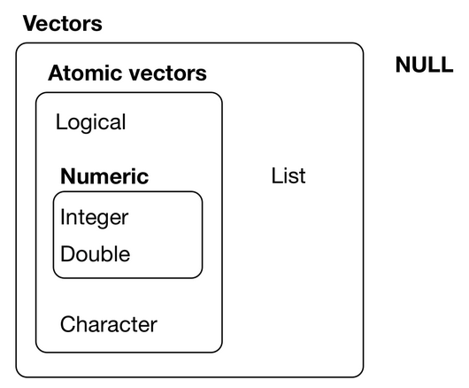
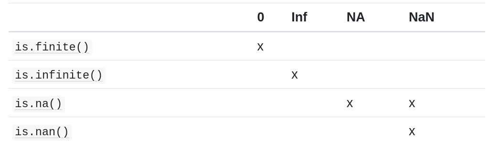
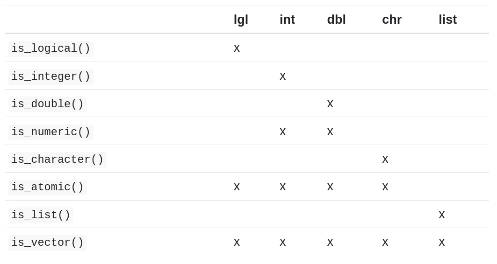

```{r setup, include=FALSE}
knitr::opts_chunk$set(echo = TRUE)
library(magrittr)
```

# Chapter 17: Intro

This is an R Markdown document covering material in R for Data Science book Chapters 17-21 (online version).  

For more details on using R Markdown, see <http://rmarkdown.rstudio.com>.

### Programming = Communicating!


Getting better at programming involves getting better at communicating.  

You want your code to become easier for others (including future you!) to read and understand what you did.  

How to write clear code? Write. **Rewrite** (while ideas are still fresh).  

The more you practice writing and rewriting, your first attempt will get better over time.  

### Tools we will cover

1. Pipes `%>%`  

1. Functions  

1. R's data structures (e.g., vectors)  

1. Iteration tools (e.g., loops)  

### Learning more

* Hands on Programming with R, by Garrett Grolemund <https://www.amazon.com/dp/1449359019/ref=cm_sw_su_dp>  

* Advanced R, by Hadley Wickham <http://adv-r.had.co.nz>  

# Chapter 18: Pipes

Pipes are a tool for expressing a sequence of multiple operations.  

```{r, eval = FALSE}
original %>%
  operation_1() %>%
  operation_2() %>%
  operation_3() -> new
```

The pipe, `%>%`, comes from the __magrittr__ package.  

Packages in the __tidyverse__ load `%>%` for you automatically.

```{r, message = FALSE}
library(magrittr)
library(tidyverse)
```

### Piping alternatives

#### 1. Save each intermediate step as a new object  

```{r, eval = FALSE}
intermediate_1 <- operation_1(original)
intermediate_2 <- operation_2(intermediate_1)
new <- operation_3(intermediate_2)
```

Main downside: forces you to name each intermediate output (tedious, error-prone).

Surprisingly however, doesn't necessarily take up more memory (because R is smart)! You can use `pryr::object_size()` to check it out yourself.  

#### 2. Overwrite the original  

```{r, eval = FALSE}
original <- operation_1(original)
original <- operation_2(original)
new <- operation_3(original)
```

Less typing (lazy) but debugging is painful.  

Error-prone: you don't know how original is changing on each line.  

#### 3. Compose functions  

```{r, eval = FALSE}
operation_3(
  operation_2(
    operation_1(original)
   ),
) -> new
```

Hard to read: have to read code from inside-out, right-to-left, potentially with arguments spread far apart

#### 4. Use the pipe!  

```{r, eval = FALSE}
original %>%
  operation_1() %>%
  operation_2() %>%
  operation_3() -> new
```

Behind the scenes, __magrittr__ reassembles the code and works by overwriting intermediate objects

### When not to use the pipe

* Your pipes are longer than (say) ten steps (debugging becomes hard).

* You have multiple inputs or outputs.

* When your operations are no longer linear but need to be more complex.  

# Chapter 19: Functions  

Functions allow you to automate common tasks.  

Important part of "do not repeat yourself" (or DRY) principle.

### When should you write a function?

When you've copied and pasted a block of code more than twice (3 copies exist!).  

It's easier to start with code that is already working and turn it into a function.  

### 3 Key steps to creating a new function

1. Pick a **descriptive name** for the function.  

1. List the inputs, or **arguments** in the function call. e.g, `function(x, y, z)`. 

1. Place the code in **body** of the function, inside the `{  }` block that follows `function(...)`.   

### 19.2.1 Exercises (#3)  

Practice turning the following code snippets into functions. 
Think about what each function does. What would you call it? 
How many arguments does it need? 
Can you rewrite it to be more expressive or less duplicative?

```{r, eval = FALSE}
mean(is.na(x))

x / sum(x, na.rm = TRUE)

sd(x, na.rm = TRUE) / mean(x, na.rm = TRUE)
```

First one.

```{r, eval = FALSE}
x <- c(1:4, NA, NA, NA, NA)
x
is.na(x)
mean(is.na(x)) # This code calculates proportion of NA values in a vector
# Name = prop_na
# Arguments = x
# Outputs = value btwn 0-1
prop_na <- function(x) {
  mean(is.na(x))
}
prop_na(x)
```

Second one.

```{r, eval = FALSE}
x <- c(1:4, NA, NA, NA, NA)
x
sum(x, na.rm = TRUE)
x / sum(x, na.rm = TRUE) # This code divides each number by total sum so that output values sum to 1
# Name = sum_to_one
# Argument = x, optional argument of na.rm
# Outputs = values between 0-1
sum_to_one <- function(x, na.rm = FALSE) {
  x / sum(x, na.rm = na.rm)
}
sum_to_one(x, na.rm = FALSE)
sum_to_one(x, na.rm = TRUE)
sum_to_one(x)
```

Third one, replaced by my made-up example to compute standard error of the mean (SEM)

```{r, eval = FALSE}
x <- c(1:4, NA, NA, NA, NA)
#sd(x, na.rm = TRUE) / sqrt(n(x, na.rm = TRUE)) # This code SHOULD calculate standard error of the mean (SEM)
# BUT n() doesn't work, and length() counts NA's as valid numbers
length(x)
length(x[!is.na(x)]) # this counts all non-NA numbers, good!
# Name = get_SEM
# Argument = x, optional argument of na.rm
# Outputs = value
get_SEM <- function(x, na.rm = TRUE) {
  sd(x, na.rm = na.rm) / sqrt(length(x[!is.na(x)]))
}
get_SEM(x)
get_SEM(x, na.rm = FALSE)
get_SEM(x, na.rm = TRUE)
```

### Some things to consider when writing functions  

* Function names should be verbs, and arguments should be nouns.   

* Exception: nouns are OK if function computes a very well known noun (e.g., `sem()` is better than `get_SEM()`).  

* Keep family of similar functions sound similar, for example by using a common prefix (e.g., `input_numbers()`, `input_text()`, `input_image()`, etc.).  

* Use comments, lines starting with `#` to explain the "why" of your code.  

### `if` Statement  

* For conditionally executing code.  

```{r, eval = FALSE}
if (condition) {
  # code executed when condition is TRUE
} else {
  # code executed when condition is FALSE
}
```

* The `condition` must evaluate to either TRUE or FALSE.  

* You can use `||` (or) and `&&` (and) to combine multiple logical expressions.  

* You should never use `|` or `&` in an `if` statement.  

* You can chain multiple if statements together, by using `if`, `else if`, `else`.  

* Other related useful things are `switch()` and `cut()`.  

### Code style (a.k.a. being kind to others, including future-you!)  

* Both `if` and `function` should (almost) always be followed by squiggly brackets (`{}`), and the contents should be indented by two spaces.  

* Anticipate important errors that R doesn't catch, by throwing an error with `stop()`, `stopifnot()`.  

* Always balance amount of extra work vs. gain.  

* Dot-dot-dot `...` is a special argument used to capture any number of arguments, useful for function that take an arbitrary number of inputs.  

### Return values

* There are two things you should consider when returning a value:  

1. Does returning early make your function easier to read (e.g., using `return()`)?  

1. Can you make your function pipeable? 

Knowing the return value's object type will mean that your pipeline will "just work". For example, with dplyr and tidyr, the object type is data frame.

# Chapter 20: Vectors  

### Vector basics

The book describes them as "objects that underlie tibbles".

Some handy functions from **purrr** package are used, which is one of tidyverse core packages.

* Definition of a **vector**:

A vector is the simplest type of data structure in R. Simply put, a vector is a sequence of data elements of the same basic type. Source: https://datascienceplus.com/vectors-and-functions-in-r/

* Definition of a **tibble**:

A tibble, or tbl_df, is a modern reimagining of the data.frame, keeping what time has proven to be effective, and throwing out what is not (https://tibble.tidyverse.org)

* Two types of vectors:

1. **Atomic** vectors
  * logical: `FALSE`, `TRUE`, `NA`
  * integer (numeric)
  * double (numeric): consider them as approximations - use `dplyr::near()` instead of `==`
  * character
  * complex
  * raw

1. **Lists** - sometimes called recursive vectors because lists can contain other lists

Main difference: atomic are homogeneous, lists can be heterogeneous.



* Two properties of a vector:

1. **Type** - you can determine with `typeof()`

1. **length** - you can determine with `length()`

* Numeric: 1 special value in integers (`NA`) but 4 special values in doubles



### Using atomic vectors

* Convert from one type to another: `as.logical()`, `as.integer()`, `as.character()`, `as.double()` and implicit coercion (`TRUE` is converted to `1` and `FALSE` is converted to `0`)

* You do different things based on type of vector; use `typeof()` or test functions provided by purrr package



* Vector recycling

Implicit coercion of length of vectors (shorter vector is recycled) which can silently conceal problems. This is why in tidyverse, you will get errors when you recycle anything other than a scalar. You can explicitly recycle with `rep()`.

* Subsetting using `[ ]` or `[[ ]]`

### Using recursive vectors (lists)

* Lists can contain other lists, suitable for representing hierarchical or tree-like structures.

* Create a list with `list()`. 

* Check out structure of a list with `str()`.

* Subsetting: `[ ]` extracts a sub-list (returns a new, smaller list), `[[ ]]` extracts a single component (removes a level of hierarchy from the list; drills down into the list), `$` extracts named elements of a list. Remember the pepper packets inside pepper shakers if that's helpful!

### Attributes

* Set attributes with `attr()`, see all attributes with `attributes()`.

* Three important attributes:

1. Names: name elements of a vector

1. Dimensions: make a vector behave like a matrix or array

1. Class: implement S3 object oriented system

### Augmented vectors

Augmented vectors are vectors with additional attributes, including class.

Four important augmented vectors:

1. Factors

1. Dates

1. Date-times

1. Tibbles

* **Factors**: Factors are designed to represent categorical data that can take a fixed set of possible values. Factors are built on top of integers, and have a levels attribute.

* Dates: numeric vectors that represent the number of days since 1 January 1970.

* Date-times: numeric vectors with class `POSIXct` that represent the number of seconds since 1 January 1970. (In case you were wondering, “POSIXct” stands for “Portable Operating System Interface”, calendar time.)

* **Tibbles**: have class “tbl_df” + “tbl” + “data.frame”, and `names` (column) and `row.names` attributes.

* The difference between a tibble and a list is that all the elements of a data frame must be vectors with the same length. All functions that work with tibbles enforce this constraint.

# Chapter 21: Iteration

Iteration is another tool for reducing duplication, e.g., repeating the same operation on different column or on different datasets.

Two important imperative paradigms: 

1. Imperative programming: tools like for loops and while loops

1. Functional programming (FP): since for loops can be quite verbose, you can extract out the duplicated code, so each common for loop pattern gets its own function, allowing you to solve problems with less code, more ease and fewer errors

### `for` loops and variations

```{r, eval = FALSE}
df <- tibble(
  a = rnorm(10),
  b = rnorm(10),
  c = rnorm(10),
  d = rnorm(10)
)

median(df$a)
#> [1] -0.2457625
median(df$b)
#> [1] -0.2873072
median(df$c)
#> [1] -0.05669771
median(df$d)
#> [1] 0.1442633

output <- vector("double", ncol(df))  # 1. output
for (i in seq_along(df)) {            # 2. sequence
  output[[i]] <- median(df[[i]])      # 3. body
}
output
#> [1] -0.24576245 -0.28730721 -0.05669771  0.14426335
```

Every loop has 3 components:

1. The **output**: `output <- vector("double", length(x))`. Always allocate sufficient space for the output (for code efficiency).

1. The **sequence**: `i in seq_along(df)` where each run of the loop will assign `i` to a different value from `seq_along(df)`.

1. The **body**: `output[[i]] <- median(df[[i]])`

Other variations include `while` loop (most often used for simulation).

### The map functions

The pattern of looping over a vector, doing something to each element is so common that purrr package provides a family of functions for this purpose:

* `map()` makes a list.
* `map_lgl()` makes a logical vector.
* `map_int()` makes an integer vector.
* `map_dbl()` makes a double vector.
* `map_chr()` makes a character vector.

```{r, eval = FALSE}
map_dbl(df, median)
#>           a           b           c           d 
#> -0.51850298  0.02779864  0.17295591 -0.61163819
df %>% map_dbl(median)
#>           a           b           c           d 
#> -0.51850298  0.02779864  0.17295591 -0.61163819
```

They share similarities with Base R functions like `lapply()`, `sapply()`, `vapply()`.

* Adverbs: combine with `safely()`, `possibly()`, `quietly()` to deal with failures.

* If you have multiple related inputs you need to iterate in parallel, use `map2()`, `pmap()` functions.

### Walk

Walk is an alternative to map when what you want is a function's side effects, e.g., render output to screen, save files on disk. 

```{r, eval = FALSE}
x <- list(1, "a", 3)

x %>% 
  walk(print)
#> [1] 1
#> [1] "a"
#> [1] 3
```

`walk2()` or `pwalk()` are generally more useful than `walk()`.

```{r, eval = FALSE}
library(ggplot2)
plots <- mtcars %>% 
  split(.$cyl) %>% 
  map(~ggplot(., aes(mpg, wt)) + geom_point())
paths <- stringr::str_c(names(plots), ".pdf")

pwalk(list(paths, plots), ggsave, path = tempdir())
```

They all invisibly return `.x`, the first argument, so they are suitable for use in the middle of pipelines.

### Other patterns of for loops

* Predicate functions that return either a single `TRUE` or `FALSE` (e.g., `keep()`, `discard()`, `some()`, `every()`, `detect()`, `head_while()`, `tail_while()`).

* `reduce(intersect)` to find the intersection, `accumulate(`+`)` to calculate a cumulative sum.
