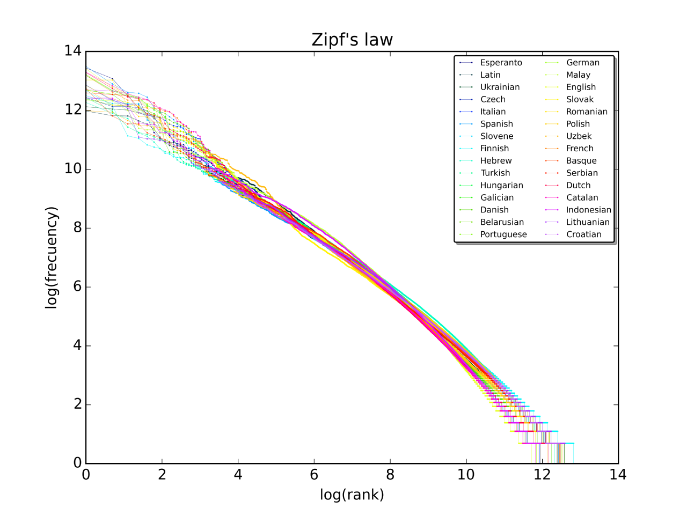
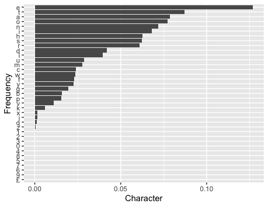
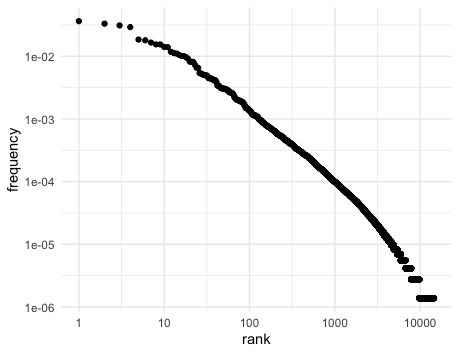
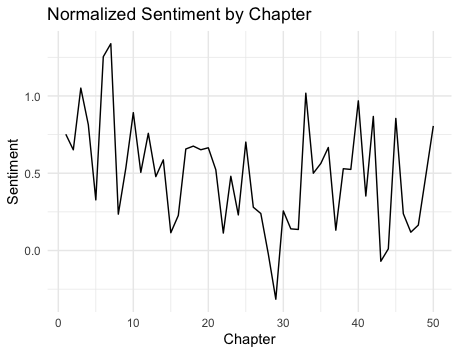

<style>
pre {
    display: block;
    font-family: monospace;
    white-space: pre;
    margin: 1em 0px;
    margin-top: 0em;
    margin-right: 0px;
    margin-bottom: 0em;
    margin-left: 0px;
}
</style>
```{r setup, include=FALSE}
knitr::opts_chunk$set(echo = FALSE)
knitr::opts_chunk$set(comment = "")
```

# unnest_tokens

.large[
* package: `tidytext`
* Tokenize a set of text and store it in a data frame
* `token`: words, characters, character_shingles, ngrams, skip_ngrams, sentences, lines, paragraphs, regex, tweets
]

---

# Stop Words

.large[
* Stop words are a set of commonly used words in any language.
* `data(stop_words)`
* There are three lexicons: SMART, snowball, onix
* We can remove stop words with an anti-join

`df %>% anti_join(stop_words)`
]

---

# Zipf's Law

.large[
* Given some corpus of utterances, the frequency of any word is inversely proportional to its rank in the frequency table.
* Holds for all languages.
]


---

# Sentiment

.large[
* use `get_sentiments()` to access sentiment libraries.
* Datasets: afinn, bing, nrc
* unigrams
]

---

# Sentiment

.large[
* afinn: numerical scores
  * -5 very negative sentiment
  * 5 very positive sentiment
* bing: binary positive/negative
* nrc: classification of words
  * A word can have multiple classifications
  * categories: trust, fear, negative, sadness, anger, surprise, positive, disgust, joy, anticipation
]

---

# `inner_join`

.large[
* Use an `inner_join()` connect the lexicon to tidy text
]


---

# Questions

.large[
Download Guttenberg book 1661 and create a character frequency that looks like the follow
]
<center>

</center>

---

# Questions

.large[
Show that Jane Austen's books follow Zipf's Law
]
<center>

</center>

---

# Questions


.large[
What is the mean sentiment per chapter of the book Sense & Sensibility.
]
<center>

</center>
