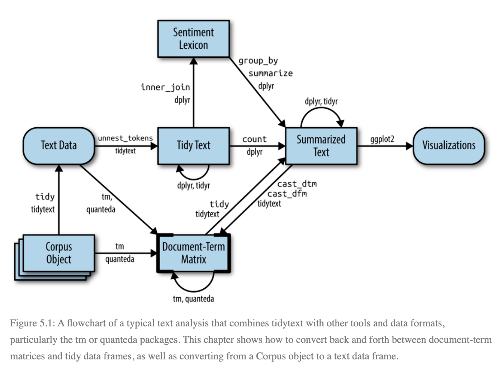
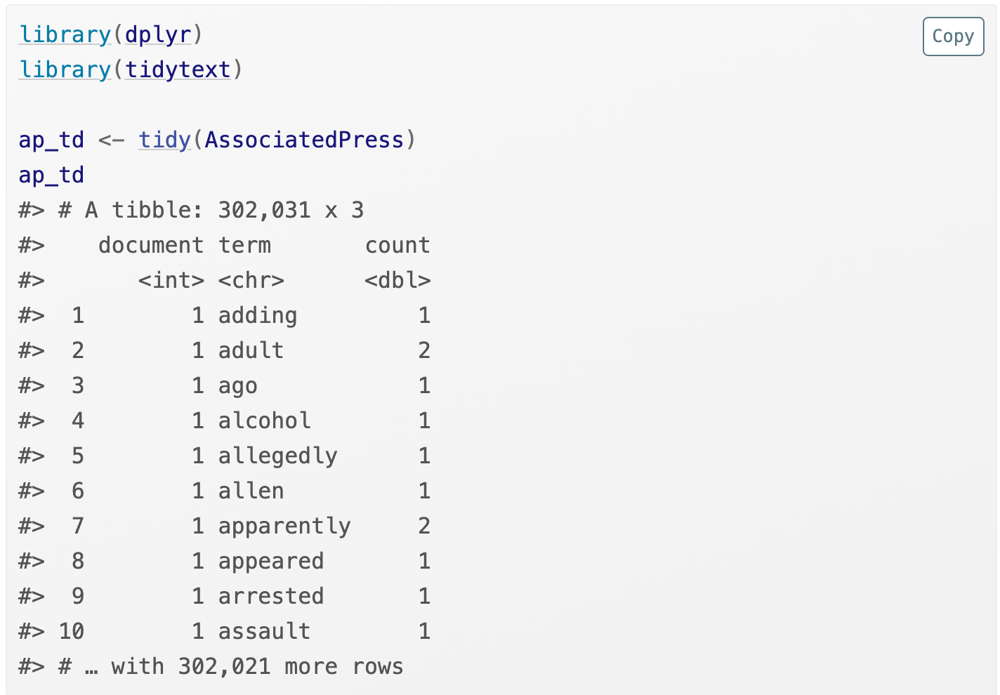
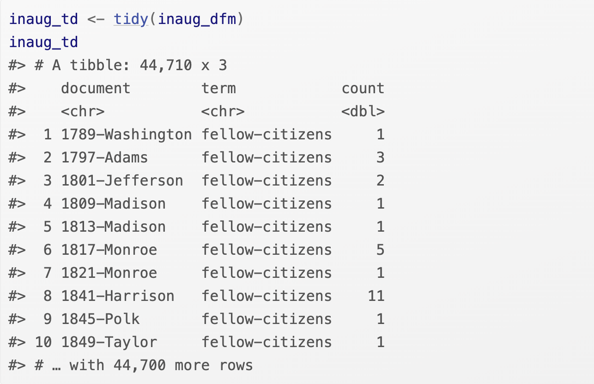
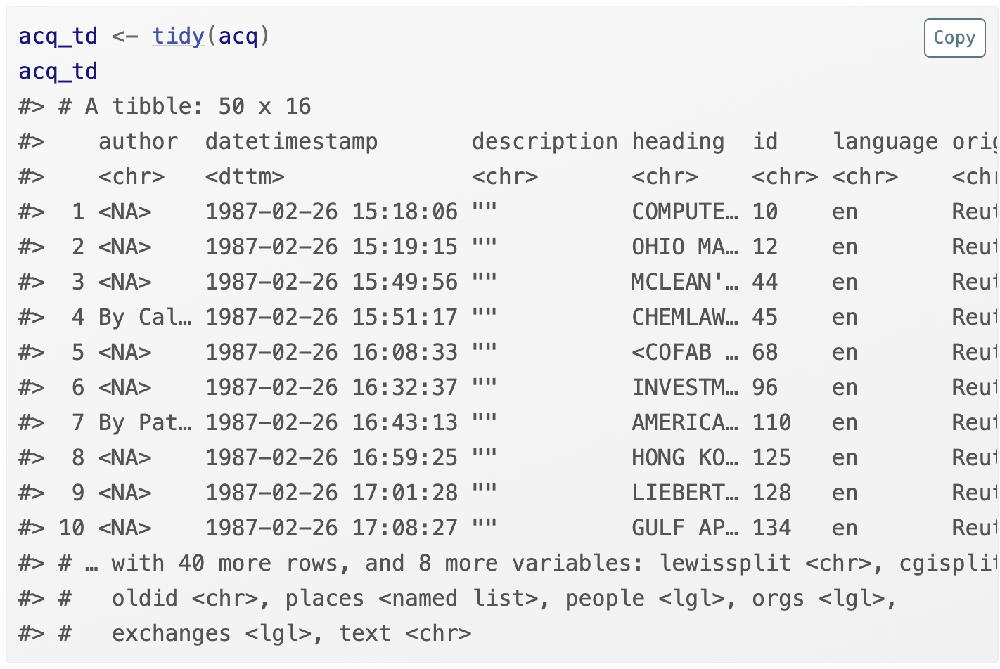
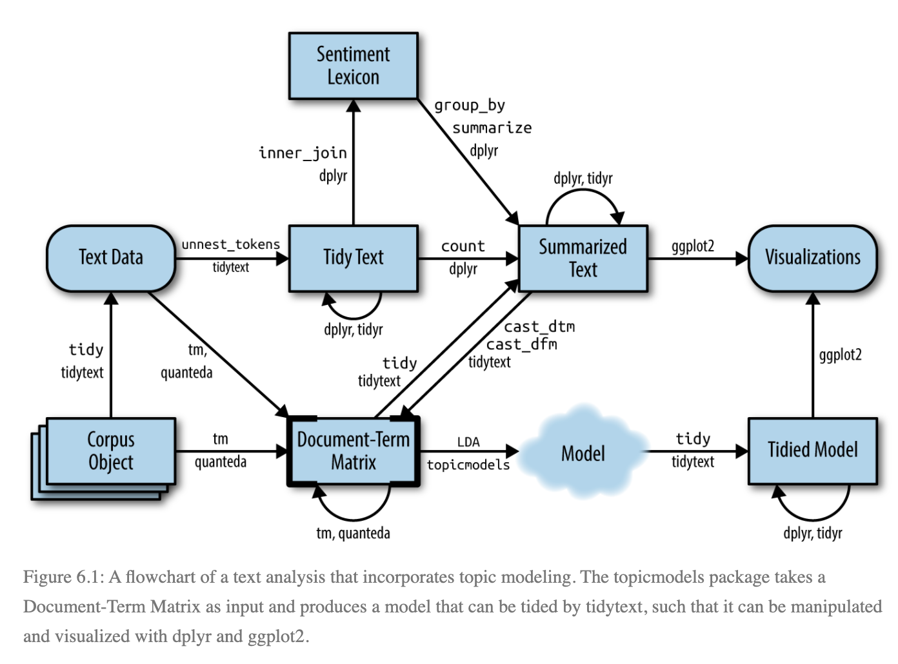
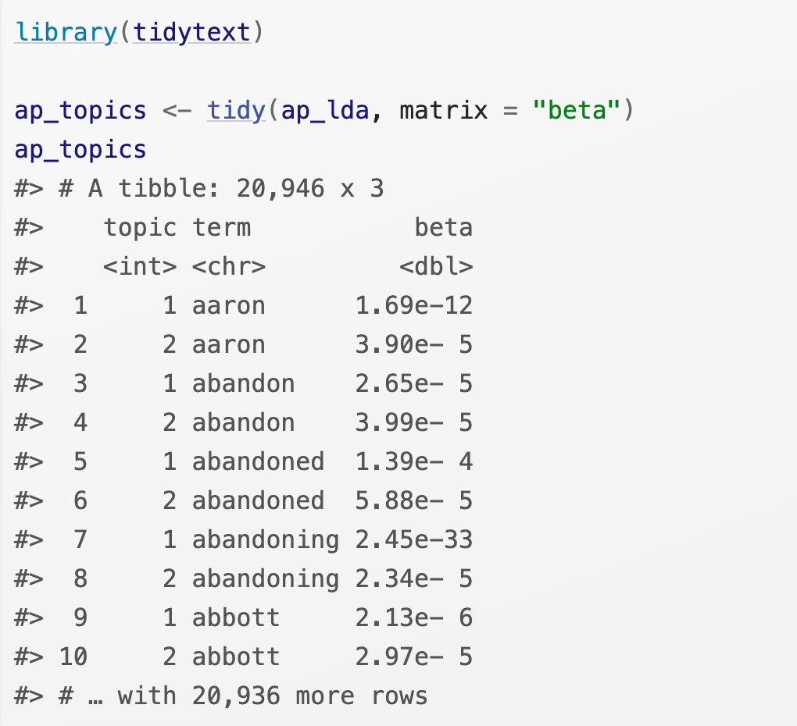
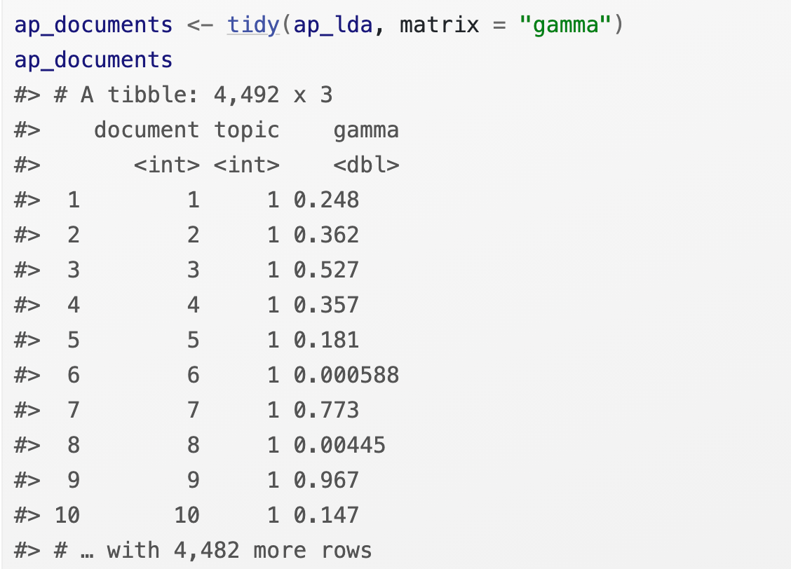
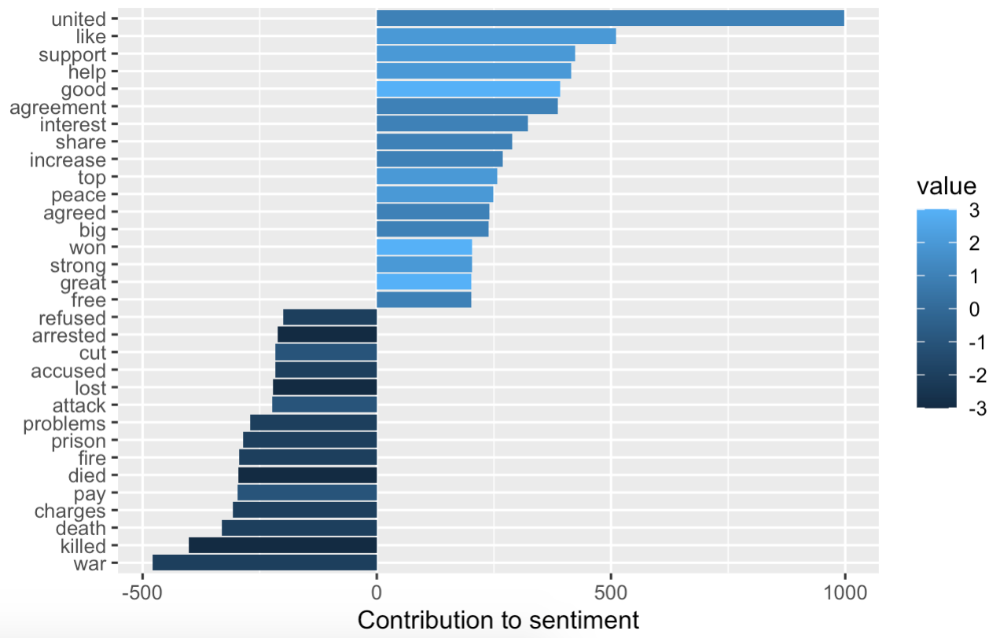
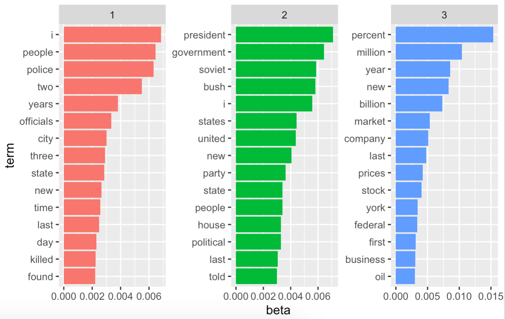

<style>
pre {
    display: block;
    font-family: monospace;
    white-space: pre;
    margin: 1em 0px;
    margin-top: 0em;
    margin-right: 0px;
    margin-bottom: 0em;
    margin-left: 0px;
}
</style>
```{r setup, include=FALSE}
knitr::opts_chunk$set(echo = FALSE)
knitr::opts_chunk$set(comment = "")
```

# Review

* **tidytext**: `unnest_tokens` restructure data in the one-token-per-row format
`anti_join()` remove stop words
* **Sentiment analysis**:  `AFINN`, `bing`, `nrc`, `inner_join()`
* **Word and document frequency**: `tf-idf` measure word importance, `Zipf’s law` frequency vs. rank, `bind_tf_idf()`
* **Word relationships**: `token = "ngrams"`, `separate()`,`unite()`, `ggraph`,`pairwise_cor()`

<br>
* tidy text format: a table with one-token-per-document-per-row

* However, most of the existing R tools for natural language processing, besides the tidytext package, aren’t compatible with this format.  

---

# Core Concepts

* **corpus**:document collections

* **document term matrix (DTM)**: 1) each row represents one document (such as a book or article) 2) each column represents one term 3) each value (typically) contains the number of appearances of that term in that document

---

# tidy vs. non-tidy data structures



* This chapter shows how to convert back and forth between document-term matrices and tidy data frames, as well as converting from a Corpus object to a text data frame.

---

# DTM

`tm` package. Most commonly used in R.



---

# dfm
`dfm` (document-feature matrix) class from the `quanteda` package



---

# Casting tidy text data into a matrix

`cast_dtm()` cast tidy text data back into a document-term matrix
`cast_dfm()` cast the table into a dfm object
`cast_sparse()` converting to a sparse matrix from the Matrix package

---

# Tidying corpus objects with metadata

**metadata**: may include an ID, date/time, title, or language for each document.



---

# Topic Modeling

* **Topic modeling** is a method for unsupervised classification of such documents, similar to clustering on numeric data, which finds natural groups of items even when we’re not sure what we’re looking for.

* **Latent Dirichlet allocation (LDA)**: a particularly popular method for fitting a topic model. It treats each document as a mixture of topics, and each topic as a mixture of words. This allows documents to “overlap” each other in terms of content, rather than being separated into discrete groups, in a way that mirrors typical use of natural language.

---

# text analysis flowchart



---

# Latent Dirichlet allocation

* **Every document is a mixture of topics.** “Document 1 is 90% topic A and 10% topic B, while Document 2 is 30% topic A and 70% topic B.”

* **Every topic is a mixture of words.** The most common words in the politics topic might be “President”, “Congress”, and “government”

* use the `LDA()` function from the topicmodels package, setting `k = n`, to create a n-topic LDA model.

---

# Word-topic probabilities

`β` in tidy method extracts the per-topic-per-word probabilities


 
---

# Document-topic probabilities

`γ` models each document as a mixture of topics.




---

# augment() function

augment() uses a model to add information to each observation in the original data.

---

# Alternative LDA implementations

`mallet` package takes non-tokenized documents and performs the tokenization itself, and requires a separate file of stopwords.This means we have to collapse the text into one string for each document before performing LDA.

---

# Questions 1 

**Visualize which words from the Associated Press news articles most often contributed to positive and negative sentiments using AFINN sentiment analysis.**





---

# Questions 2

**Create a 3-topic LDA model of the AP data. Calculate word-topic probabilities. Then visualize the 15 terms that are most common within each topic.**

