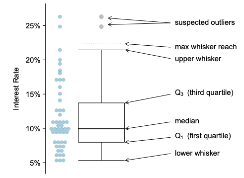
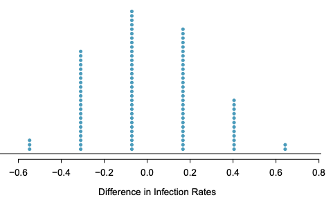

<style>
pre {
    display: block;
    font-family: monospace;
    white-space: pre;
    margin: 1em 0px;
    margin-top: 0em;
    margin-right: 0px;
    margin-bottom: 0em;
    margin-left: 0px;
}
</style>

```{r setup, include=FALSE}
knitr::opts_chunk$set(echo = FALSE)
library(ggplot2)
library(tibble)
```

# Histograms

* The shape can change significantly with bin width.
* Use variable bin with long tail. Keep the area the same.

---

# Mean and Variance

* These are really just moments
$$\mu_n = \int_{-\infty}^{\infty} (x-c)^n f(x)dx$$

* The n-th moment about zero of a probability density function $f(x)$ is the expected value of $X^n$. $F(x)$ is the cumulative probability function.

$$\mu^{'}_n = \mathbb{E}[X^n] = \int_{-\infty}^{\infty} x^n dF(x)$$

|Moment Ordinal (n)|Moment  |
|:----------------:|:------:|
|1                 |Mean    |
|2                 |Variance|
|3                 |Skew    |
|4                 |Kurtosis|

---

# Box Plot



* Whiskers are 1.5 * IQR or the last point in that range.

---

# Variation in the Data

What is variation in the data?


---

# Problems

* Problem 2.27 p77
* Problem 2.28 p77
* Problem 2.30 p77
* Problem 2.32 p78
* Problem 2.33 p78

---

# Problem 2.27

a) It decreases the average as it is below the mean.

b) The new mean would be:
```{r, echo=TRUE}
(24 * 74 + 64 ) / (24 + 1)
```

c) It will increase it.
Recall:
$$\mathbb{E}[X^2] = \frac{\sum(x-\mathbb{E}[X])^2}{n-1}$$
Assuming the change of $\mathbb{E}[X]$ is small. The new variance will be something like:
```{r, echo=TRUE}
sqrt(((24 - 1) * 8.9^2 + (74 - 64)^2 ) / (24 + 1 - 1))
```

---

# Problem 2.28

a) Q1 is at the p=0.25 so that would be somewhere in the 0-10 bin. Let us assume that it is uniform in that bin. Q1 would be about:
```{r, echo=TRUE}
Q1 <- 10 - 10 * (.37 - .25) / .37; print(Q1)
```
Q3 is at p=0.75. If we add the bins to get to that value we have:
```{r, echo=TRUE}
Q3 <- 0.37 + 0.22 + 0.11 + 0.05; print(Q3)
```
That gets us to 40 infant moralities and Q3.
The IRQ would be:
```{r, echo=TRUE}
IQR = Q3 - Q1; print(IQR)
```

b) The mean of the dataset will be larger than the median. The data is right skewed so the bulk of the values are to the left so the median will be towards the left. However, with the long tail the mean is shift towards the tail, thus it is larger than the median.

---

# Problem 2.30

a) symmetric

b) left skewed

c) right skewed


---

# Problem 2.32

The data is not symmetric as the maximum score is 100% so we would expect that there should be some value that are more that 1 SD away. However, that would violate the maximum score as mean (85%) + 1 SD(15%) is already 100%. We would not be seeing data beyand the one SD in the positive direction. Therefore the data must be left skewed.

---

# Problem 2.33

```{r, echo=TRUE, fig.height=1}
data <- c(57, 66, 67, 71, 72, 73, 74, 77, 78, 78, 79, 81, 81, 82, 83, 83, 88, 89, 94)
tibble(x = data) |> ggplot(aes(x = data)) + geom_boxplot()
```

```{r, echo=TRUE}
IQR <- 82.5 - 72.5; print(IQR)
wisker <- 1.5 * IQR; print(wisker)
wisker_max <- 82.5 + wisker; print(wisker_max)
actual_wisker_max <- min(max(data), wisker_max); print(actual_wisker_max)
wisker_min <- 72.5 - wisker; print(wisker_min)
actual_wisker_min <- max(min(data[data > wisker_min]), wisker_min); print(actual_wisker_min)
```
